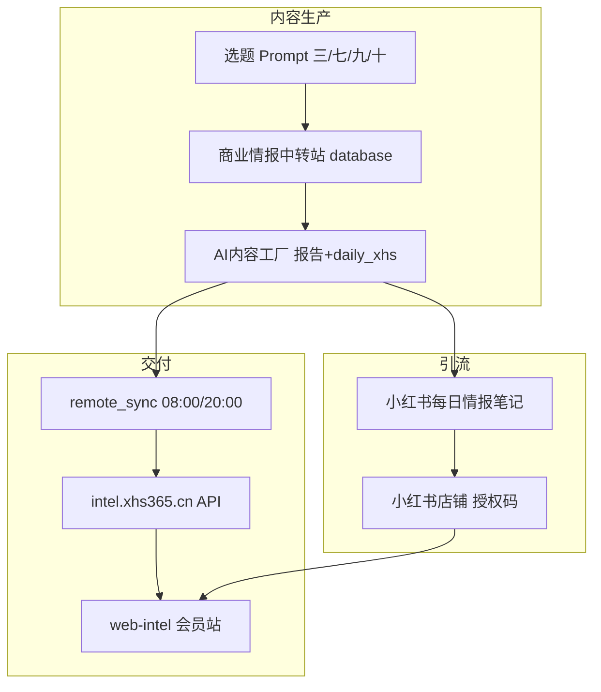

# 系统与提示词全面审计（2026-05-25）

> 对齐基准：[00-产品与提示词对齐总纲.txt](../AI互联网信息量化/00-产品与提示词对齐总纲.txt)

---

## 1. 系统全景

| 组件 | 状态 | 说明 |
|------|------|------|
| 情报数据库 | ✅ 可用 | trend/opportunity/risk/emotion 已同步 |
| intel 站 | ✅ 可用 | 套餐、报告预览、分类标签已迭代 |
| 每日小红书脚本 | ✅ 新增 | `generate_daily_intel.py` |
| 10 天小红书矩阵 | ❌ 应废弃 | 多处 Prompt 仍描述 Day01~10 |
| 封面 V8 | ⚠️ 部分 | `regen_covers_v8` 仍含 Day10 模板、旧 IP 页脚 |
| Notion 层 | ⚪ 可选 | 全局总控仍写第四层，非主路径 |

---

## 2. 提示词文件审计表

| 文件 | 对齐度 | 主要问题 | 处置 |
|------|--------|----------|------|
| **00-产品与提示词对齐总纲.txt** | ✅ 新建 | SSOT | 后续改 Prompt 必读 |
| **0-全局总控.txt** | ❌→✅ 已改 | Step2.6 仍写 10 天矩阵；目录结构旧 | 本次已更新 Step2.6/目录/调用链 |
| **0-总控.txt（内容工厂）** | ⚠️ 部分 | 开篇仍「AI副业内容生产」；content_angles 写 10 天 | 本次已改开篇+引用总纲 |
| **0-中转站总控.txt** | ❌→✅ 已改 | 选题 5 问仍要求「拆 10 天」 | 改为「可拆每日情报+深度报告」 |
| **3-每日情报小红书单篇.txt** | ✅ | 现行小红书规范 | 保持 |
| **3-生成小红书爆款笔记.txt** | ⚠️ 归档 | 正文 900+ 行仍含 V7/41岁/AI副业示例 | 顶部已废弃声明；**勿整文件给模型** |
| **1/2/4/5/6 Prompt** | ⚠️ | 5/6 开篇「AI副业」命名；与 SKU 弱绑定 | 5/6 已改开篇+会员分层 |
| **小红书合规红线.txt** | ✅ | 已增网络兼职/AI副业 | 保持 |
| **remote_sync/系统同步指南.md** | ⚠️ | 示例 JSON 仍用 category AI副业 | 数据字段可保留，笔记禁用 |
| **regen_covers_v8.py** | ⚠️ | AI决策分析师页脚、Day10、#AI副业 | 页脚已改；Day10 标废弃 |
| **generate_daily_intel.py** | ✅ | 敏感词过滤 | 保持 |
| **web-intel 文案** | ⚠️→✅ | Logo「AI副业情报」 | 改为「副业财富情报」 |

---

## 3. 产品 ↔ 内容对齐矩阵

| 用户触点 | 应传达的价值 | 当前内容风险 |
|----------|--------------|--------------|
| 小红书笔记 | 今日 1 条可验证信号 + 避坑 | 旧稿：连载/AI副业/月入/假评论 |
| 店铺 9.9 | 7 天进站看简报+报告 | 笔记未写清权益，只卖「报告」感 |
| 站仪表盘 | 今日简报 = 日报 JSON 的 UI 化 | ✅ 基本对齐 |
| 决策报告 | 周报 HTML + 选题深度报告 | ✅ API 预览已修 |
| 趋势/机会/风险 | database 可视化 | ✅ 与中转站一致 |

**统一叙事**：小红书只发**情报碎片**；**完整库**在 intel 会员站（授权码）。

---

## 4. 优先级整改（建议执行顺序）

### P0（已完成或本次提交）

1. 发布 `00-产品与提示词对齐总纲.txt`
2. 同步 `0-全局总控.txt` Step 2.6 → 每日情报
3. 同步 `0-中转站总控.txt` 选题 5 问
4. 前端品牌「副业财富情报」
5. 5/6 日报周报 Prompt 开篇与会员分层

### P1（建议下一迭代）

1. 将 `3-生成小红书爆款笔记.txt` 拆为 `3-归档-十天矩阵-勿用.txt` + `3-封面与标题公式.txt`（避免模型读全文）
2. `regen_covers_v8.py` 增加 `--daily` 模式：读 `daily_xhs/{date}/title.txt` 出 cover.png
3. `0-全局总控` 输出目录增加 `daily_xhs/` 示例
4. 数据库 JSON 的 `category` 字段逐步改为「轻创业情报」等（可选，不影响 API）

### P2（运营）

1. 小红书只发 `daily_xhs` 产出；旧 Day 笔记下架或改标签
2. 店铺主图写清：付款 → 自动授权码 → intel 站
3. 每周 1 篇选题深度报告上传 intel（`report_upload`），笔记只引流

---

## 5. 给 AI 执行工作流时的推荐读序

1. `00-产品与提示词对齐总纲.txt`
2. `0-全局总控.txt`（调度）
3. 任务类型二选一：  
   - 发小红书 → `3-每日情报小红书单篇.txt`  
   - 做选题报告 → `0-总控.txt` + `1-AI高级PDF...`（跳过 Step4 十天）
4. `小红书合规红线.txt`

**禁止**：把 `3-生成小红书爆款笔记.txt` 全文作为单次任务 Prompt（会复活 10 天与 AI副业 示例）。

---

## 6. 审计结论

系统**数据层与 intel 站**已按「副业情报会员」形态成型；**最大错位**在 Prompt 层仍大量描述「10 天小红书 + AI副业 IP + 假评论」，与当前产品、平台合规、你的运营策略不一致。

本次已通过 **对齐总纲 + 全局/中转站/日报周报/前端** 修补主干；封面脚本与旧 Prompt 归档需按 P1 继续收口。

// AIGC END
