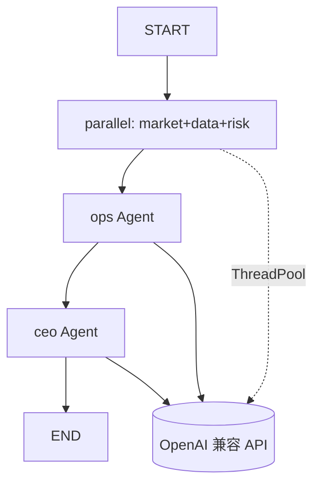

# AI 多 Agent 编排（LangGraph + 真 LLM）

> **版本**：v1.0  
> **代码入口**：`services/agent_graph.py`  
> **Prompt**：`prompts/agents.yaml`

---

## 1. 架构



| Agent | 职责 | 输出键 |
|-------|------|--------|
| market | 趋势与驱动因素 | `trend_summary`, `market_drivers` |
| data | 指标解读 | `metric_interpretation`, `data_highlights` |
| risk | 风险评估 | `risk_assessment`, `risk_level` |
| ops | 可执行建议 | `action_plan` |
| ceo |  executive 摘要 | `executive_summary`, `opportunity_stars`, `confidence`, `verdict` |

**并行策略**：market / data / risk 在 `parallel` 节点内用 `ThreadPoolExecutor` 并发调用 LLM；ops 与 ceo 串行，携带前序 JSON 摘要。

---

## 2. 环境变量（默认 PackyAPI + DeepSeek V4 Flash）

复制 `.env.example` → `.env`，详见 **`docs/13-LLM-PACKYAPI-DEEPSEEK.md`**。

```bash
INSIGHT_LLM_PROVIDER=packy_deepseek
INSIGHT_LLM_API_KEY=sk-xxx
INSIGHT_LLM_BASE_URL=https://www.packyapi.com/v1
INSIGHT_LLM_MODEL=deepseek-v4-flash
INSIGHT_LLM_THINKING=disabled
INSIGHT_LLM_FALLBACK_MOCK=1
```

| 变量 | 默认 | 说明 |
|------|------|------|
| `INSIGHT_LLM_API_KEY` | 空 | 也可使用 `DEEPSEEK_API_KEY`（与主仓库一致） |
| `INSIGHT_LLM_PROVIDER` | `packy_deepseek` | PackyAPI 中继 DeepSeek |
| `INSIGHT_LLM_MODEL` | `deepseek-v4-flash` | 与 [PackyAPI DS 文档](https://docs.packyapi.com/docs/advanced/DeepSeekClaudeCode.html) 一致 |
| `INSIGHT_LLM_THINKING` | `disabled` | 关闭 V4 thinking，降延迟 |
| `INSIGHT_LLM_MODEL_CEO` | 同 flash | 可设为 `deepseek-v4-pro` |
| `INSIGHT_LLM_FALLBACK_MOCK` | `1` | LLM 失败时降级 mock |
| `INSIGHT_LLM_THINKING` | `disabled` | V4 关闭 thinking 降延迟 |

---

## 3. 调用链

```
run_insight_pipeline.py
  → metric_engine.build_metrics()
  → agent_graph.run_agents(metrics)
  → compliance_gate.assert_publishable()
  → report_builder.build_html()
```

`local-web-prototype/server.py` 的 `/api/generate` 同样调用 `run_agents`。

---

## 4. 降级策略

1. **无 API Key** → `ai_orchestrator.run_agents_mock`（规则模板）
2. **LLM HTTP/解析错误** 且 `FALLBACK_MOCK=1` → mock
3. **LLM 返回空摘要** → mock
4. **强制 mock**：`run_agents(metrics, force_mock=True)`

---

## 5. 依赖

```text
# requirements-lab.txt
langgraph>=0.2.0
langchain-core>=0.3.0
pyyaml>=6.0
```

安装：

```powershell
cd E:\vuemonitor\projects\ai-market-intelligence-v2
pip install -r requirements-lab.txt
```

---

## 6. 本地验证

```powershell
# 无 Key：mock
python scripts/run_insight_pipeline.py --date 2026-07-12

# 有 Key：真 LLM
$env:INSIGHT_LLM_API_KEY="xxx"
python scripts/run_insight_pipeline.py --date 2026-07-12
```

检查 `output/latest.json` 中 `executive_summary` 是否与 mock 模板不同。

---

## 7. 合规约束

- LLM **输入** 仅类目级指标 JSON（见 `agent_graph._metrics_prompt`）
- LLM **输出** 仍经 `ComplianceGate` 扫描后再发布
- Prompt 共享规则禁止商品 ID、店铺名、违法建议

---

## 8. Phase 2 升级项

见 `12-DESIGN-GAPS-AND-ROADMAP.md` § 3.2：Prompt 台账、JSON Schema、token 监控、人工复核队列。
