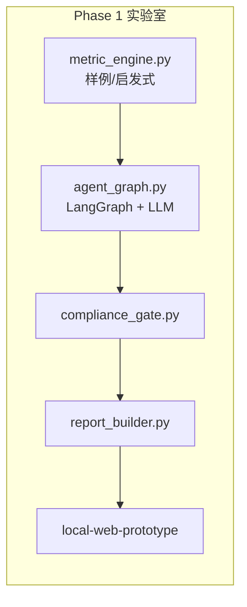

# 系统设计缺陷分析与需求升级路线图

> **版本**：v1.0  
> **日期**：2026-07-12  
> **目的**：在 Phase 1 实验室基础上，识别当前架构/代码/合规/运维缺口，并升级为 **可执行的 Phase 2～4 需求**  
> **读者**：产品、架构、开发、法务、运维

---

## 一、Executive Summary

V2 实验室已具备：**指标引擎 → LangGraph 多 Agent（真 LLM + mock 降级）→ ComplianceGate → HTML 报告 → 本地 Web 原型**。  
但距离 **可上现网 Shadow / 正式切换** 仍有 **9 大类、37 项** 缺口。本文按 **严重度 × 阶段** 排序，供下一迭代 PRD 直接引用。

| 严重度 | 数量 | 代表项 |
|--------|------|--------|
| 🔴 P0 阻塞上线 | 8 | PG 实连、审计表、投诉流、LLM 出境评估 |
| 🟠 P1 核心能力 | 12 | 类目推断、k-匿名、指标准确性验证 |
| 🟡 P2 体验与运维 | 11 | 监控告警、Prompt 版本化、A/B |
| 🟢 P3 护城河 | 6 | 自研指数 IP、官方数据合作 |

---

## 二、当前系统能力快照（As-Is）

| 模块 | 状态 | 说明 |
|------|------|------|
| `metric_engine.py` | ⚠️ 样例级 | 从本地 JSON/启发式生成指标，**未接 PG raw 表** |
| `agent_graph.py` | ✅ 可用 | market/data/risk 并行 → ops → ceo；PackyAPI DeepSeek；无 Key 降级 mock |
| `llm_client.py` | ✅ | 默认 `packy_deepseek` + `deepseek-v4-flash` |
| `agent_validate.py` | ✅ | Agent JSON Schema 校验 |
| `audit_log.py` | ✅ | 发布审计 JSONL |
| `metric_engine_pg.py` | ⚠️ 骨架 | 需 `INSIGHT_PG_DSN` |
| `compliance_gate.py` | ✅ 单测通过 | 发布前 hard fail |
| `cloud-stubs/` | 📄 参考补丁 | **未合并** xhs-cloud |
| 法律模板 | ✅ v1.0-template | 须法务定稿后挂网 |
| 数据库 | 📄 SQL 文档 | **未建表、未迁移** |

---

## 三、缺陷清单（按域）

### 3.1 数据层与指标引擎 🔴

| ID | 缺陷 | 影响 | 升级需求 |
|----|------|------|----------|
| D-01 | **无 PG 实连**：管道读样例 JSON，非 `raw_product_snapshots` | 指标不可信，无法 Shadow 对照 V1 | Phase 2：`MetricEnginePG` 读只读副本；每日 job 对齐 V1 日期 |
| D-02 | **类目推断启发式**：关键词/标题规则粗糙 | 错类目 → 错情报 | 引入类目树 + 多信号融合（关键词 TF-IDF + 价格带 + 人工校正表） |
| D-03 | **k-匿名未实现**：小样本类目可能反推单品 | 合规/re-identification 风险 | 发布前 `n >= k`（建议 k=5～10）否则合并类目或 suppress |
| D-04 | **原始快照无 TTL job** | 数据囤积、PIPL 保留期 | `pg_cron` 或 timer 删除 >180d raw；文档化台账 |
| D-05 | **指标准确性未验证** | 蓝海/竞争指数为「自研黑盒」 | 建立 **黄金样本集** + 与 V1 聚合交叉验证；版本化公式 |

**需求条目（写入 PRD）**：

- **REQ-DATA-001**：MetricEngine 必须支持 `source=pg|sample` 双模式，Shadow 期强制 `pg`。
- **REQ-DATA-002**：所有对外指标附带 `sample_size`、`window_days`、`formula_version`。
- **REQ-DATA-003**：`sample_size < k` 时 ComplianceGate 拒绝发布或自动升维类目。

---

### 3.2 AI / LangGraph 层 🟠

| ID | 缺陷 | 影响 | 升级需求 |
|----|------|------|----------|
| A-01 | **无 Prompt 版本台账表** | 审计、投诉无法追溯 | DB 表 `prompt_registry(version, hash, deployed_at)` |
| A-02 | **无 LLM 输出结构化校验** | JSON 缺字段时静默空报告 | ✅ `agent_validate.py` |
| A-03 | **无 token / 成本监控** | 日报告量放大后不可控 | ✅ `llm_meta.usage`；日预算熔断待做 |
| A-04 | **并行节点错误处理弱** | 部分 Agent 失败仅 append errors | ✅ CEO 最低成功集 + mock 降级 |
| A-05 | **无人工复核队列** | 高风险类目无法拦截 | `review_status=pending` 工作流（Phase 3） |
| A-06 | **境外 LLM 未做法务评估** | 可能构成数据出境 | 默认 PackyAPI + DeepSeek V4 Flash；隐私政策模板已填 |

**需求条目**：

- **REQ-AI-001**：`run_agents()` 返回 `agent_trace_id`，关联各 Agent 输入 hash（不含 raw）。
- **REQ-AI-002**：ComplianceGate 在 AI 输出后再扫 **违法建议关键词**（刷量、抄款等）。
- **REQ-AI-003**：支持 `INSIGHT_LLM_PROVIDER=domestic_only` 硬开关。

---

### 3.3 合规与法律 🔴

| ID | 缺陷 | 影响 | 升级需求 |
|----|------|------|----------|
| L-01 | 法律模板 **未法务定稿** | 不能直接挂网 | 外部律师 review → 定稿 PDF/HTML |
| L-02 | **无会员页协议勾选** | 同意缺失 | 注册/续费强制勾选 + 版本号存储 |
| L-03 | **无投诉/纠错 API** | 暂行办法 15 日机制无法满足 | `POST /api/v2/feedback` + 工单表 + SLA |
| L-04 | **无算法备案路径评估** | 监管不确定性 | 法务问卷：是否公众服务、是否推荐排序 |
| L-05 | **报告 AI 标识未强制进 HTML** | 深度合成标识缺失 | `report_builder` 注入固定 footer + meta |
| L-06 | **数据来源台账缺失** | 训练/推理溯源 | `data_lineage` 表：snapshot_batch_id → metrics |

**需求条目**：

- **REQ-LEGAL-001**：上线 Gate 必须 0 违规 + 三份法律文档 URL 可访问。
- **REQ-LEGAL-002**：每次发布写入 `compliance_audit_log`。

---

### 3.4 云端集成与双轨 🟠

| ID | 缺陷 | 影响 | 升级需求 |
|----|------|------|----------|
| C-01 | `cloud-stubs/` **未合并** xhs-cloud | 无法 Shadow | 按 `08-REMOTE-UPGRADE-RUNBOOK.md` 合并 insight 路由 |
| C-02 | **无 V1/V2 并行 timer** | 无法对照 | Shadow：`insight_pipeline` 只写 `insight_*` 表，不影响 zip |
| C-03 | **会员页双 Tab 未上线** | 用户看不到 V2 | Legacy + AI 情报 Tab；权限按套餐 |
| C-04 | **JWT 与 insight API 未打通** | 鉴权缺口 | 复用现网 `database_pg` 会员校验 |
| C-05 | **无 feature flag** | 切换风险大 | `INSIGHT_V2_ENABLED` 环境变量 + 白名单用户 |

**需求条目**：

- **REQ-CLOUD-001**：Phase 2 仅只读 PG + 写 insight 表，**禁止**改 V1 zip 逻辑。
- **REQ-CLOUD-002**：回滚脚本：关闭 flag 即恢复纯 V1。

---

### 3.5 PC 客户端 🟡

| ID | 缺陷 | 影响 | 升级需求 |
|----|------|------|----------|
| P-01 | `cloud_client.py` insight API **未实现** | PC 无法拉 V2 | 按 `09-PC-CLIENT-INTEGRATION.md` |
| P-02 | WebView 仍指向 V1 HTML | 体验割裂 | 内嵌 `insight/index.html` 或远程 URL |
| P-03 | 设备绑定与 V2 权益未同步 | 多设备滥用 | 沿用现网 device cap |

---

### 3.6 安全与运维 🟠

| ID | 缺陷 | 影响 | 升级需求 |
|----|------|------|----------|
| O-01 | **无生产监控** | 管道失败无人知 | Prometheus/日志告警：pipeline、LLM 5xx |
| O-02 | **无密钥轮换** | Key 泄露风险 | KMS 或 env + 季度轮换 |
| O-03 | **无 RBAC** | 内部 raw 表暴露面 | 管理员/分析员/只读 API |
| O-04 | **备份与 DR 未文档化** | insight 表丢失 | 与 V1 PG 同策略 |

---

### 3.7 产品体验 🟡

| ID | 缺陷 | 影响 | 升级需求 |
|----|------|------|----------|
| U-01 | 仅 6 页静态 HTML | 交互弱 | Phase 3：Chart.js 趋势、类目对比 |
| U-02 | 无「为何推荐」可解释性 | 信任度 | 展示输入指标摘要（非 raw） |
| U-03 | 无多类目订阅 | 商业扩展 | 会员套餐 = N 类目/月 |
| U-04 | 无历史报告对比 | 留存 | `insight_reports` 按 user+category+date |

---

### 3.8 测试与质量 🟡

| ID | 缺陷 | 影响 | 升级需求 |
|----|------|------|----------|
| T-01 | 仅 `test_compliance_gate.py` | 回归不足 | Agent mock 集成测试、pipeline e2e |
| T-02 | 无 LLM 回归集 | Prompt 改动破质量 | 20 条黄金 metrics → 期望结构快照 |
| T-03 | 无负载测试 | 日峰未知 | 100 并发 insight API |

---

### 3.9 文档与治理 🟢

| ID | 缺陷 | 影响 | 升级需求 |
|----|------|------|----------|
| G-01 | `01-DOCUMENT-INDEX` 15 份子文档多数 **待写** | 大模型协作碎片化 | 按 Phase 2 优先写 07-AI、09-INDEX、14-AUTH |
| G-02 | 无 ADR（架构决策记录） | 重复讨论 | `docs/adr/001-langgraph-sequential-join.md` |

---

## 四、升级后的 Phase 路线图

### Phase 2 — Shadow 管道（4～6 周）

**目标**：现网旁路生成 V2 情报，**零影响** V1 买家。

| 优先级 | 交付物 | 验收 |
|--------|--------|------|
| P0 | PG MetricEngine + k-匿名 | Shadow 7 天 0 合规 fail |
| P0 | 合并 `cloud-stubs` + insight API | 白名单账号可预览 |
| P0 | 法律三文档定稿挂网 | URL 200 + 版本号 |
| P1 | 投诉 API + audit 表 | 模拟工单 15 日闭环 |
| P1 | LLM 境内供应商 + 成本日志 | 日报告 <$X |

### Phase 3 — 在期买家可选 V2（2～4 周）

- 会员页双 Tab；Legacy 到期提醒升级 V2
- PC WebView insight；feature flag 扩量
- 人工复核队列（高风险类目）

### Phase 4 — V2 默认、V1 退场

- 新购停售 zip；SEO 改「AI 市场情报」
- V1 timer 只服务 Legacy 到期用户
- 指标 IP 对外白皮书

---

## 五、需求文档结构升级建议

在 `00-MASTER-SPEC.md` 基础上，**下一版 PRD 应增加**：

1. **§ 非功能需求（NFR）**：k-匿名、k、LLM 超时、SLA 99.5%
2. **§ 数据 lineage**：raw → metrics → agent → report 全链路 ID
3. **§ 发布 Gate 自动化**：CI 跑 compliance + schema + k-anonymity
4. **§ 双轨切换状态机**：`legacy_only | shadow | dual | v2_only`
5. **§ 开放问题**：算法备案是否必须（法务 TBD）

建议新建 **`docs/13-REQUIREMENTS-V2.1.md`** 作为 Phase 2 唯一 PRD 入口（可从本文导出）。

---

## 六、LangGraph 集成说明（Phase 1 已完成）

| 配置 | 说明 |
|------|------|
| `INSIGHT_LLM_API_KEY` | 未设置 → `run_agents_mock` |
| `INSIGHT_LLM_FALLBACK_MOCK=1` | LLM 异常时降级（默认开） |
| `prompts/agents.yaml` | Prompt v1，5 Agent |
| 入口 | `scripts/run_insight_pipeline.py`、`local-web-prototype/server.py` |

详见 **`docs/07-AI-AGENTS-LANGGRAPH.md`**。

---

## 七、风险矩阵

| 风险 | 概率 | 影响 | 缓解 |
|------|------|------|------|
| 平台 ToS 变更导致 raw 不可用 | 中 | 高 | 官方 API 合作；降低 raw 依赖 |
| LLM 幻觉导致错误建议 | 高 | 中 | ComplianceGate + 免责声明 + 投诉 |
| 小样本类目 re-id | 中 | 高 | k-匿名 + 类目合并 |
| 境外 LLM 出境 | 低 | 高 | 默认境内模型 |
| V1 买家反弹 | 中 | 中 | 双轨履约至到期 |

---

## 八、下一步行动（建议顺序）

1. ✅ 法律模板 → **法务定稿**（外部）
2. ✅ LangGraph 接线 → **本地有 Key 跑通**（内部）
3. 🔲 实现 `REQ-DATA-001` PG MetricEngine
4. 🔲 实现 `REQ-LEGAL-002` audit 表 + 投诉 stub
5. 🔲 合并 cloud-stubs 到 xhs-cloud 开发分支
6. 🔲 编写 `13-REQUIREMENTS-V2.1.md`

---

**维护**：每 Phase 结束更新本文 § 二快照与 § 四路线图。
