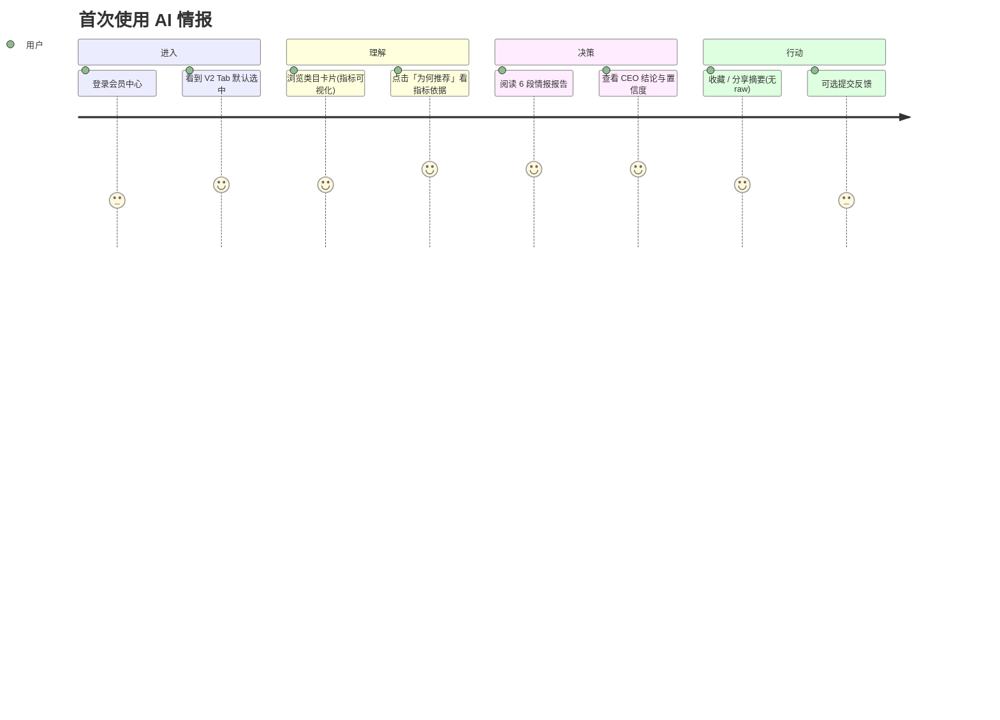

# 用户体验设计规范（UX · V2 AI 市场情报）

> **版本**：v1.0  
> **日期**：2026-07-12  
> **原则**：不接真实 PG/LLM 亦可验证体验；实验室 `member-demo.html` 为交互基准  
> **关联**：`16-ADVANCED-PRODUCT-ARCHITECTURE.md`、`14-REQUIREMENTS-V2.1.md`

---

## 一、设计目标

| V1 用户心智 | V2 目标心智 |
|------------|------------|
| 「下载数据包自己筛」 | 「每天打开看结论」 |
| 表格 + 排序 | 评分 + 叙事 + 行动清单 |
| 担心合规 | 明确「研究情报」定位 |

**North Star**：用户能在 **3 分钟内** 理解「这个类目值不值得进、下一步做什么」。

---

## 二、用户角色与场景

| 角色 | 典型场景 | 核心诉求 |
|------|----------|----------|
| 在期 Legacy 买家 | 习惯 zip/data.js | 不断服、有迁移引导 |
| 新 V2 会员 | 每日看情报 | 快、可信、能行动 |
| PC 桌面用户 | WebView 内嵌报告 | 与云端账号一致 |
| 运营/客服 | 处理投诉 | 15 日 SLA 可追溯 |

---

## 三、信息架构（会员中心）

```
选品报告中心
├── Tab A：Legacy 数据报告（履约期可见）
│   ├── 日期列表 · 下载 zip · 在线预览（V1）
│   └── 横幅：「您的套餐含 Legacy 履约，到期后切换 AI 情报」
└── Tab B：AI 市场情报（V2 默认主推）
    ├── 今日推荐类目（卡片：星级 / 增速 / 蓝海）
    ├── 我的情报库（历史按日期 × 类目）
    ├── 生成 / 阅读（iframe 或内页）
    └── 纠错与反馈（Modal → POST /feedback）
```

**实验室入口**：`local-web-prototype/member-demo.html`

---

## 四、核心用户旅程

### 4.1 新用户首次打开（V2）



### 4.2 Legacy 双轨用户

1. 默认仍可见 Legacy Tab，**不打断**现有下载习惯  
2. V2 Tab 顶部：**「体验 AI 情报预览」** CTA（非强制）  
3. Legacy 到期前 30/7/1 天：站内信 + 横幅提醒  
4. 到期后：Legacy Tab 隐藏或只读历史，V2 成为主入口  

### 4.3 报告阅读（6 页结构）

| 页 | 用户问题 | UX 要求 |
|----|----------|---------|
| 1 趋势评分 | 机会多大？ | 大号星级 + 一句话摘要 |
| 2 AI 总结 | 发生了什么？ | 短段落，避免 jargon |
| 3 市场机会 | 数字怎么说？ | 增速/竞争可视化条 |
| 4 AI 建议 | 我做什么？ | 清单：类目/价格带/内容形式/时间线 |
| 5 风险提示 | 有什么坑？ | 醒目但非恐吓 |
| 6 总结 | 进还是不进？ | verdict + 置信度 + 下一步 |

---

## 五、交互规范

### 5.1 加载与反馈

| 状态 | 表现 | 时长预期 |
|------|------|----------|
| 类目列表加载 | Skeleton 卡片 | <1s（mock） |
| 生成报告 | 分步进度：指标→5 Agent→合规→发布 | mock ~2s；真 LLM 15～45s |
| 失败 | 明确文案 + 「重试」+ 不空白 | — |
| 空库 | 「明日 18:00 后更新」+ 说明刷新规则 | — |

**禁止**：点击无反应、无限 loading、500 无提示（V1 会员页教训）。

### 5.2 可解释性（Trust）

每份报告必须可回答：**「这个结论依据哪些指标？」**

- 折叠面板「指标依据」：仅展示类目级公开指标（增速、竞争、蓝海、价格带、趋势标签）  
- **不展示** sample_size 对外（内部 k-匿名用）  
- AI 页脚固定：「AI 辅助生成 · 非投资建议 · [纠错]」

### 5.3 移动端

- 报告 `max-width: 720px`，单列  
- 类目卡片堆叠，指标用 mini bar  
- iframe 预览高度 `min(70vh, 640px)`  
- 触控目标 ≥ 44px  

### 5.4 无障碍

- 星级同时显示文字（如「机会 4/5」）  
- 对比度 WCAG AA  
- 关键按钮有 `aria-busy`  during loading  

---

## 六、文案规范（摘要）

完整文案见 `config/ux_copy.yaml`。

| 场景 | 文案 |
|------|------|
| V2 定位 | AI 市场情报 — 类目趋势与决策建议，非原始数据包 |
| Legacy 横幅 | 您的套餐含历史数据报告履约，到期后将统一为 AI 情报 |
| 空状态 | 今日情报生成中，预计 18:00 后可阅读 |
| AI 标识 | 本内容由 AI 辅助生成，仅供市场研究参考 |
| 反馈成功 | 已收到，我们将在 15 个工作日内处理 |

---

## 七、与 V1 体验对比（迁移话术）

| 能力 | V1 | V2 |
|------|----|----|
| 找具体商品 | ✅ 表格 | ❌ 不提供（合规） |
| 看类目趋势 | 需自己算 | ✅ 直接给结论 |
| 下载 csv | ✅ | ❌ |
| 每日决策速度 | 慢 | 快 |
| 合规风险感知 | 高 | 低（产品叙事） |

**对外一句话**：V2 不是「少给了数据」，而是「把分析做完再给你」。

---

## 八、实验室验收清单（UX）

- [ ] 双 Tab 可切换，Legacy 有说明横幅  
- [ ] 类目卡片含增速/蓝海/竞争可视化  
- [ ] 生成时有分步进度（mock 可模拟）  
- [ ] 报告含指标依据折叠区 + 6 页导航  
- [ ] 反馈 Modal 可提交并收到 ticket_id  
- [ ] 空状态 / 错误状态有文案  
- [ ] 手机宽度 375px 可用  

---

## 九、需求映射

| UX 需求 ID | 说明 | 实现 |
|------------|------|------|
| REQ-UX-001 | 双轨 Tab | `member-demo.html` |
| REQ-UX-002 | 可解释指标面板 | `report_builder.py` |
| REQ-UX-003 | 生成进度反馈 | `member-demo.js` |
| REQ-UX-004 | 投诉/纠错入口 | `POST /api/v1/feedback` |
| REQ-UX-005 | 情报库列表 | `GET /api/v1/insight/library` |
| REQ-UX-006 | 统一文案 | `config/ux_copy.yaml` |
| REQ-UX-007 | 类目对比工作台 | ✅ `compare.html` |
| REQ-UX-008 | 趋势时间轴 | ✅ `timeline.html` |
| REQ-UX-009 | 决策 Kanban | ✅ `workflow.html` |
| REQ-UX-010 | 智能提醒中心 | ✅ `notifications.html` |
| REQ-UX-011 | PDF 摘要导出 | ✅ `report_export.py` + 打印页 |
| REQ-UX-012 | 套餐额度模拟 | ✅ `subscription_mock.py` + `plans.yaml` |

---

**下一步**：Phase 3 合并进现网 `member_portal.html` 时，以本文 §五、§八 为验收标准。
