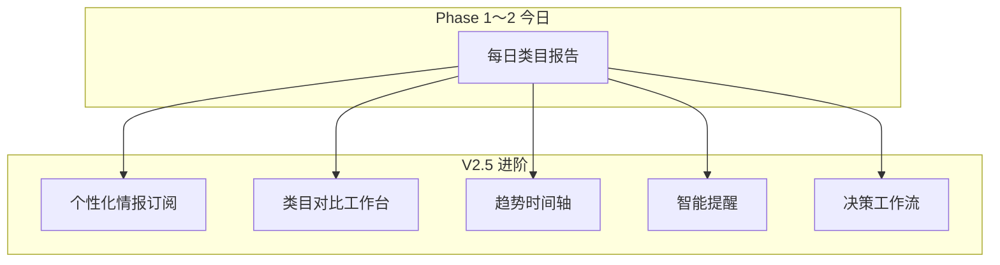

# 进阶产品架构设计（V2.5 · Intelligence Platform）

> **版本**：v1.0  
> **日期**：2026-07-12  
> **定位**：在 Phase 2 工程之上，描述 **下一代** 产品能力（不要求立即实连）  
> **读者**：产品、架构、投资/合作讨论

---

## 一、从「日报工具」到「情报平台」



---

## 二、十层进阶架构（在 Master Spec 六层之上）

| 层 | 名称 | 职责 | 用户可见 |
|----|------|------|----------|
| L7 | **订阅与偏好** | 关注类目、价格带、刷新频率 | 我的赛道 |
| L8 | **对比与基准** | 多类目横向、WoW/MoM | 对比页 |
| L9 | **通知与触达** | 阈值告警、邮件/PC 推送 | 提醒中心 |
| L10 | **决策工作流** | 假设→验证→复盘 | 我的项目 |

L1～L6 不变（raw 隔离 + 合规 Gate）。

---

## 三、核心进阶能力

### 3.1 个性化情报（无 PII）

**原则**：个性化只能基于 **用户声明的偏好 + 历史阅读行为**，不能基于商品/店铺 ID。

| 输入 | 输出 |
|------|------|
| 用户关注类目列表 | 首页排序加权 |
| 常读价格带 | 建议区优先展示 |
| 上次 verdict=观望 | 次日推送「变化摘要」 |

数据结构（草案）：

```json
{
  "user_id": "hash",
  "watchlist": ["小学教辅", "美甲美睫"],
  "price_band_pref": "10-30",
  "notify_rules": { "blue_ocean_above": 75, "growth_above_pct": 25 }
}
```

### 3.2 类目对比工作台

- 并排 2～3 个类目的 **指标雷达图**（仅聚合指标）  
- AI 生成 **「相对推荐序」**（非排名具体商品）  
- 导出：**PDF 摘要**（无 data.js）

### 3.3 趋势时间轴（Intelligence Timeline）

- 每类目保留 **每日指标快照**（非 raw）  
- 图表：7/14/30 天 growth、competition、blue_ocean 曲线  
- AI **周复盘**：「较上周，竞争升高 12 点，建议…」

表设计（见 `07-DATABASE-SCHEMA-V2.sql` 扩展）：

```sql
-- insight_metric_daily(category, report_date, metrics_json, formula_version)
```

### 3.4 智能提醒（Notification Intelligence）

| 触发器 | 示例 | 渠道 |
|--------|------|------|
| 蓝海突破阈值 | 美甲美睫 blue_ocean>80 | PC 托盘 + 会员中心 |
| 风险升高 | risk_level 低→高 | 邮件 |
| Legacy 到期 | 7 天前 | 站内横幅 |

**不做**：「某商品涨价了」类可定位通知。

### 3.5 决策工作流（Decision OS）

将情报接入用户 **选品项目** 轻量 Kanban：

```
想法 → AI初评 → 小样本验证 → 上架/放弃 → 复盘
```

每卡片挂载：关联情报 report_id、用户笔记（本地/云端）、最终 outcome。

---

## 四、AI 进阶：从 5 Agent 到「情报委员会」

### 4.1 当前（Phase 1.5）

```
market + data + risk → ops → ceo
```

### 4.2 进阶（Phase 3+）

| Agent | 新增价值 |
|-------|----------|
| **season** | 季节/节日专项 |
| **channel** | 内容渠道建议（小红书/抖音权重） |
| **benchmark** | 与历史同类目对比叙述 |
| **red_team** | 专门挑刺，降低幻觉信任风险 |

编排：**red_team 在 ceo 前**，对 ops 输出做法务/逻辑挑战。

### 4.3 人机协同

- `review_status`: auto | pending | approved  
- 高风险类目（竞争>80 或 样本边界）→ 人工 5 分钟抽检  
- 用户反馈 → **Prompt 微调队列**（非在线学习 raw）

---

## 五、商业与套餐进阶

| 套餐 | 能力 |
|------|------|
| V2-Starter | 1 类目/日，Web 阅读 |
| V2-Pro | 5 类目，对比工作台，30 天时间轴 |
| V2-Team | 多席位，决策工作流，API 只读摘要 |
| Legacy | 仅履约，不新签 |

**护城河**：指数公式版本 + 历史时间轴 + 用户决策数据（合规聚合）。

---

## 六、PC 客户端统一体验

```
ProductAnalyzer
├── 研究助手（浏览公开页，本地）
├── 情报中心 WebView → V2 报告
├── 提醒托盘（订阅规则同步云端）
└── 离线缓存：最近 7 天已读报告 HTML（无 raw）
```

与云端：**同一 JWT、同一 watchlist**。

---

## 七、数据与合规进阶

| 能力 | 合规要点 |
|------|----------|
| 时间轴 | 只存 metrics，不存 title 库 |
| 对比 | k-匿名跨类目均满足 |
| 通知 | 文案经 ComplianceGate |
| 工作流笔记 | 用户自有内容，不做训练 |

---

## 八、技术演进路线（无实连阶段可设计）

| 阶段 | 交付 | 依赖实连 |
|------|------|----------|
| **Now** | UX 原型 + mock 全链路 + 对比/时间轴/工作流 | ❌ |
| Phase 2 | Shadow PG + 真 LLM | ✅ |
| Phase 3 | 时间轴 + 对比页 | PG 指标表 |
| Phase 4 | 通知 + 工作流 | 会员 API |
| Phase 5 | red_team + 人工复核 | LLM + 运维 |

---

## 九、竞品对标（体验层）

| 产品 | 借鉴 | 不借鉴 |
|------|------|--------|
| 飞瓜/蝉妈妈 | 仪表盘、趋势叙事 | 商品级导出 |
| Notion AI | 结构化报告阅读 | 通用写作 |
| Bloomberg Terminal | 指数 + 摘要 | 金融实时 tick |

**差异化**：「小红书赛道 + 合规聚合 + 多 Agent 决策叙事」。

---

## 十、开放问题（产品决策）

1. V2 是否提供 **PDF 导出**？（建议：仅摘要，含水印）  
2. 是否做 **类目自定义**（用户输入关键词→系统映射类目）？  
3. Team 版是否允许 **共享 watchlist**（不含 raw）？  
4. Legacy 用户是否赠送 **1 个月 V2 Pro** 促进迁移？

---

**维护**：重大产品决策写入 `docs/adr/`（待建）。
