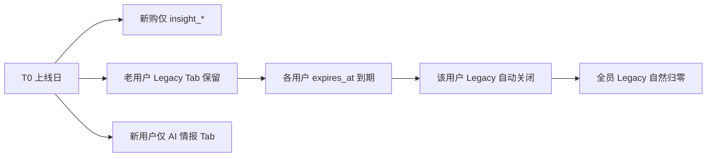

# Legacy 数据包下线与 V2 全量上新执行方案

> **版本**：v1.0 · **决策日期**：2026-07-12  
> **战略**：V2 **不提供** zip/data.js 下载；**所有新开会员仅 V2**；Legacy 数据包 **仅老用户履约至自然到期**  
> **禁止**：按自然月一刀切关停全部老用户（季付/年付仍在期内）

---

## 一、决策摘要（已拍板）

| 项 | 决定 |
|----|------|
| 13 | V2 新会员 | **只卖 AI 选品情报**，`legacy_zip_enabled: false` |
| 14 | **在期老会员（monthly 等）** | **双轨**：`legacy_zip_enabled: true` + `insight_enabled: true`，至 `expires_at` |
| 数据包下载 | V2 **永久舍弃**，不作为 SKU、不作为双轨选项 |
| 老用户 | 已购 `monthly/quarterly/…` 且 **未过期** → 继续 zip 至 `expires_at` |
| 新购/续费（上线日后） | **只能买** `insight_*`，不能再买纯 Legacy 套餐 |
| 「月底下线」 | 指 **停售 + 停发 Legacy 码**，**不是**提前掐断未到期会员 |

---

## 二、为什么不能「这个月过完全体下线」

现网会员按 **`memberships.expires_at`** 履约，不是按自然月：

| 老用户可能情况 | 若月底强制下线 |
|----------------|----------------|
| 月付 7 月初刚续费 | 损失 ~23 天 → 投诉/退款 |
| 季付/半年/年付 | 损失数月～一年 → 法律与口碑风险 |
| 客服私发码未到期 | 违约 |

**合法且可执行的「下线」定义**：

1. **销售下线**：上线日起，`GET /api/v1/payment/plans` **只返回** `insight_*`  
2. **履约下线**：每位老用户在其 **`expires_at` 当日 24:00** 失去 zip 下载权  
3. **生成下线（可选）**：老用户占比极低后，Legacy zip 管道改为只读归档、不再日更  

---

## 三、推荐时间线（可执行）

假设 **V2 上线日 = T0**（建议选一周内有 Shadow 情报可读的日期，如 2026-08-01）：



| 时间点 | 动作 |
|--------|------|
| **T0 前 1 周** | Shadow 管道产出情报；会员页加 AI Tab（白名单） |
| **T0 00:00** | `XHS_V2_LAUNCH=1`；支付套餐切换为 V2-only；公告挂网 |
| **T0 当天** | 新注册用户默认 `insight_enabled`；无 Legacy 下载 API 权限 |
| **T0～T0+30d** | 老用户横幅：「您的数据包权益至 YYYY-MM-DD，到期后仅 AI 情报」 |
| **每个 expires_at** | `legacy_zip_enabled` 自动 false；隐藏 Legacy Tab |
| **最后一名 Legacy 到期后** | 关闭 zip 生成 timer（可选）；仅保留情报管道 |

**你说的「这个月过完」应落实为**：

- ✅ **8 月 1 日起不再销售数据包套餐**  
- ❌ **不是 8 月 1 日关掉所有老用户下载**

---

## 四、用户分群与界面

| 分群 | 判定 | 会员中心 |
|------|------|----------|
| **新用户** | T0 后首次开通，或 plan_code 为 `insight_*` | 仅 **AI 市场情报** Tab |
| **Legacy 在期** | plan_code ∈ `{monthly,quarterly,halfyear,yearly}` 且 `expires_at > now` | **AI 情报** + **数据报告 Legacy**（只读履约） |
| **Legacy 已到期** | 上类但已过期 | 仅 AI 情报；引导续费 `insight_pro` |
| **体验码** | `experience` + note | 按 note 限制，**无 zip**（V2 体验也不发 bulk） |

---

## 五、技术 Gate（合并现网时照抄）

### 5.1 支付层

```python
# T0 后 list_active_plans() 仅返回 INSIGHT_PAYMENT_PLANS
# 不再返回 monthly/quarterly/halfyear/yearly
```

文件：`cloud-stubs/payment_plans_v2_patch.py` → 合并 `payment_plans.py`

### 5.2 权益层

```python
LEGACY_PLAN_CODES = frozenset({"monthly", "quarterly", "halfyear", "yearly", "pay_test"})

def legacy_zip_enabled(user_id) -> bool:
    m = get_active_member(user_id)  # 或最近一条 membership
    if not m or m["expires_at"] <= now:
        return False
    plan = m["plan_code"]
    if plan.startswith("insight_"):
        return False
    ent = get_member_entitlements(user_id)
    if ent and ent.get("legacy_zip_enabled") is False:
        return False
    return plan in LEGACY_PLAN_CODES
```

- 下载 API `…/reports/{date}/download`：**先调** `legacy_zip_enabled`，否则 **403** + 文案引导 V2  
- 情报 API：**仅要** `insight_enabled`（V2 用户默认 true）

### 5.3 会员页

- T0 后默认 Portal Tab：**选品报告中心** 文案改为 **「AI 选品情报」**  
- Legacy 报告列表：`if (!profile.legacy_zip_enabled) hide #dashLegacy`  
- 免费体验包 Tab：可保留 **静态样例**，不等于 data.js 全量售卖  

---

## 六、对外公告（模板）

> 自 2026-08-01 起，选品报告中心升级为 **AI 选品分析系统**，新会员仅提供 **类目级市场情报与 AI 决策建议**，不再提供含商品明细的数据包下载。  
> 在此之前已开通且未到期的会员，可继续使用数据报告至您的会员到期日。到期后请续费 **AI 情报 Pro** 套餐。

---

## 七、上线前检查清单

- [ ] Shadow 情报至少稳定 7 天可读  
- [ ] `payment_plans` 已切换 V2-only（无 monthly 等）  
- [ ] `legacy_zip_enabled` Gate 接入下载/批量下载 API  
- [ ] `member_portal.html`：新用户无 Legacy Tab  
- [ ] 用户协议/购买页文案已去掉「数据包」承诺  
- [ ] 管理端：新发码默认 `insight_pro` / `experience`，不发纯 Legacy 商用码  
- [ ] SQL：`SELECT COUNT(*) FROM memberships WHERE expires_at > NOW() AND plan_code IN ('monthly',...)` 知悉在期人数  

---

## 八、与双轨方案 C 的关系

**双轨月卡 `dual_monthly` 已取消**（与「V2 舍弃数据包」一致）。  
过渡期只靠 **老 SKU 自然到期**，不靠新卖双轨。

---

## 九、风险与对策

| 风险 | 对策 |
|------|------|
| 老用户反弹 | 明确到期日 + 提前 30/7 天横幅 |
| 情报未就绪就上线 | T0 不得早于 Shadow 稳定 |
| 误关未到期用户 | 仅以 `expires_at` 为准，不以自然月 |
| 合规质疑 | 对外统一「AI 研究工具」；zip 仅履约不扩售 |

---

**关联**：`18-MEMBERSHIP-SCHEME-DESIGNS.md`、`17-XHS-CLOUD-BASE-REUSE.md`、`cloud-stubs/legacy_gate.py`
