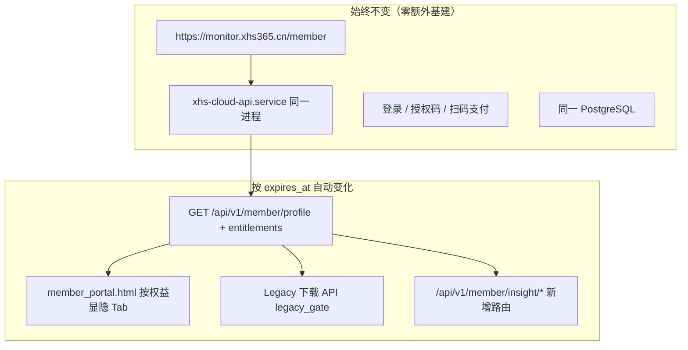

# Phase 2.2 上线需求文档（评估落地版）

> **版本**：v2.2.4  
> **日期**：2026-07-12  
> **来源**：架构评估报告 + `19-LEGACY-SUNSET-AND-V2-LAUNCH.md`  
> **业务前提**：全员月卡；7 月中旬预告；现网 Legacy 页不动；**仅新会员默认 V2 独立页**

---

## 1. 目标

将评估结论转化为可追踪需求 ID，分 **实验室（Lab）** 与 **现网合并（Prod）** 两轨交付；实验室先行验证路由、权益、配额与 V2 独立门户，合并时照抄 `cloud-stubs/`。

---

## 2. 用户分群与路由（核心）

| 分群 | 判定 | 默认门户 | Legacy zip |
|------|------|----------|------------|
| **新会员** | `plan_code` 为 `insight_*` | `insight_portal` | ❌ |
| **老会员在期** | `monthly` 等且 `expires_at > now` | `member_portal`（现网） | ✅ 至到期 |
| **老会员预览** | 上类 + `insight_preview: true` | `member_portal` + 外链 V2 预览 | ✅ |
| **体验码（新）** | `experience` + V2 note | `insight_portal` | ❌ |

### 需求列表

| ID | 需求 | 验收标准 | 阶段 | 状态 |
|----|------|----------|------|------|
| REQ-RT-001 | 新会员登录后 **不得** 默认进入 Legacy Tab | `portal_route=insight_only` 时无 zip UI | Lab+Prod | ✅ Lab |
| REQ-RT-002 | 老会员主界面保持现网 `member_portal.html` | **增量** AI Tab + Gate 显隐；默认 Tab 仍为报告库 | Prod | ✅ 骨架 |
| REQ-RT-003 | 老会员预览通过 **独立链接** 进入 V2 | `/member/insight` → `insight_portal.html` | Lab | ✅ Lab |
| REQ-RT-004 | `GET /api/v1/member/profile` 返回 `portal_route` + `entitlements` | 前端据此跳转/显隐 | Lab+Prod | ✅ Lab |
| REQ-RT-005 | 实验室支持三种 persona 切换（演示用） | `insight_pro` / `legacy_preview` / `legacy_only` | Lab | ✅ Lab |

---

## 3. 权益与套餐（Entitlements）

| ID | 需求 | 验收标准 | 阶段 | 状态 |
|----|------|----------|------|------|
| REQ-ENT-001 | `plans.yaml` 与 `payment_plans_v2_patch.py` **plan_code 一致** | `insight_monthly` / `insight_pro_monthly` / `insight_team_monthly` | Lab | ✅ |
| REQ-ENT-002 | 新购套餐 `legacy_zip_enabled: false` | entitlements 模板强制 | Lab+Prod | ✅ stub |
| REQ-ENT-003 | 预览权益模板 `PREVIEW_ENTITLEMENTS_LEGACY` | `insight_preview`+`legacy_zip_enabled`+1 类目/日 | Lab+Prod | ✅ |
| REQ-ENT-004 | 新体验码模板 **无 zip** | `EXPERIENCE_ENTITLEMENTS_V2_ONLY` | Lab+Prod | ✅ |
| REQ-ENT-005 | `legacy_gate.legacy_zip_enabled()` 门控下载 API | 无权益 → 403 + 引导文案 | Prod | ⏳ stub ✅ |
| REQ-ENT-006 | 情报生成门控 `can_insight_generate()` | 无 `insight_enabled` → 403 | Lab+Prod | ✅ |
| REQ-ENT-007 | 取消 `dual_monthly` 新售 | 支付列表无 dual SKU | Prod | ✅ doc |

---

## 4. 认证与多租户

| ID | 需求 | 验收标准 | 阶段 | 状态 |
|----|------|----------|------|------|
| REQ-AUTH-001 | 实验室 **不** 自建 auth，合并时桥接现网 JWT | insight 路由 `Depends(current_member)` | Prod | ⏳ |
| REQ-AUTH-002 | 实验室 persona 仅用于演示，标注 LAB | 响应含 `lab_mode: true` | Lab | ✅ |
| REQ-TEN-001 | 关注列表/配额按 persona 隔离 | `output/sessions/{persona}/` | Lab | ✅ |
| REQ-TEN-002 | 报告存储路径 `{user_id}/{date}/{category}/` | 不覆盖全局 `preview.html` | Lab | ⏳ P1 |

---

## 5. 配额与 LLM 成本

| ID | 需求 | 验收标准 | 阶段 | 状态 |
|----|------|----------|------|------|
| REQ-QUOTA-001 | 类目配额：检查与记录 **同一事务**（Prod PG） | `insight_daily_usage_migration.sql` | Prod | ✅ SQL |
| REQ-QUOTA-002 | 实验室配额按 persona 独立计数 | 切换 persona 额度不串 | Lab | ✅ |
| REQ-QUOTA-003 | API 速率限制 | 10 req/min per IP（Prod nginx） | Prod | ⏳ |
| REQ-LLM-010 | 日 Token 预算熔断 | 超预算 → 503 | Lab | ✅ |
| REQ-LLM-011 | 每次 generate 累加 usage | `output/llm_usage.json` | Lab | ✅ |

---

## 6. 合规与数据管道

| ID | 需求 | 验收标准 | 阶段 | 状态 |
|----|------|----------|------|------|
| REQ-COMP-001 | 所有对外输出经 `compliance_gate` | 已有 | Lab | ✅ |
| REQ-COMP-002 | 细分类目 k-匿名提升至 10（可配置） | `INSIGHT_K_ANONYMITY=10` | Lab | ⏳ P2 |
| REQ-DATA-010 | Shadow 管道读 PG 快照 | `metric_engine_pg` + DSN | Phase 2 | ⏳ |
| REQ-DATA-011 | 日更定时任务 | Legacy 17:00 + insight 预生成 02:30（见 **22**） | Prod | ⏳ |
| REQ-CACHE-001 | 夜间 TOP-N 类目预生成入库 | `cloud_insight_report.py --playbook full` | Phase 2 | ✅ 骨架 |
| REQ-CACHE-002 | 用户读预生成报告零 LLM | Cache-First API | Phase 2 | ⏳ |
| REQ-DATA-012 | Agent 缓存 Redis | key=`prompt_version:metrics_hash` | Prod | ⏳ P2 |

---

## 7. 门户与 UX

| ID | 需求 | 验收标准 | 阶段 | 状态 |
|----|------|----------|------|------|
| REQ-UX-020 | **V2 独立门户** `insight_portal.html` | 无 Legacy Tab；默认 AI 情报 | Lab | ✅ |
| REQ-UX-021 | `member-demo.html` 保留为双轨 **实验室对照** | 文档与页内横幅注明 | Lab | ✅ |
| REQ-UX-022 | 预览横幅文案 | 「体验版，正式开通以公告为准」 | Lab | ✅ |
| REQ-UX-023 | 7 月中旬公告模板 | 见 `19-LEGACY-SUNSET` §6 | 运营 | ✅ doc |
| REQ-UX-024 | 导航各子页以 V2 门户为默认入口 | `lab-charts.js` renderLabNav | Lab | ✅ |

---

## 8. 现网合并清单（T0 ≈ 8 月初）

| ID | 任务 | 文件 | 状态 |
|----|------|------|------|
| REQ-PROD-001 | 支付仅 `insight_*` | `payment_plans.py` | ⏳ |
| REQ-PROD-002 | 新会员激活 → `insight_portal` | 新 HTML + 登录跳转 | ⏳ |
| REQ-PROD-003 | 合并 `entitlements_v2` + `legacy_gate` | `database_pg.py` | ⏳ |
| REQ-PROD-004 | insight API 路由 | `cloud-stubs/insight_routes.py` | ⏳ |
| REQ-PROD-005 | `member_insight_watchlist` 表 | migration SQL | ⏳ |
| REQ-PROD-006 | `insight_daily_usage` 原子配额表 | `insight_daily_usage_migration.sql` | ✅ SQL |
| REQ-PROD-007 | 支付回调写 entitlements note | `payment_service.py` | ⏳ |

---

## 9. 时间线映射

| 时间 | 需求批次 |
|------|----------|
| **现在～7 月中旬** | REQ-RT-* Lab ✅、REQ-ENT-* ✅、REQ-UX-020/022 ✅、REQ-LLM-010 ✅ |
| **7 月中旬** | REQ-UX-023 运营公告；发放预览码（REQ-ENT-003） |
| **T0 8 月初** | REQ-PROD-001～007 |
| **各 expires_at** | REQ-ENT-005 自动关闭 Legacy |

---

## 10. v2.2.1 Lab 代码交付清单

| 文件 | 说明 |
|------|------|
| `docs/20-REQUIREMENTS-V2.2-ROLLOUT.md` | 本文档 |
| `config/plans.yaml` | 与 V2 SKU 对齐 |
| `cloud-stubs/entitlements_v2.py` | 预览/新体验模板 + `portal_route()` |
| `cloud-stubs/legacy_gate.py` | Legacy zip 门控 |
| `cloud-stubs/insight_daily_usage_migration.sql` | Prod 配额表 |
| `services/lab_session.py` | 三种 persona |
| `services/llm_budget.py` | 日 Token 预算 |
| `services/subscription_mock.py` | 按 persona 隔离配额 |
| `services/insight_watchlist_lab.py` | 按 persona 隔离关注 |
| `local-web-prototype/insight_portal.html/js` | V2 独立门户 |
| `local-web-prototype/server.py` | profile / persona / generate 熔断 |
| `tests/test_rollout_lab.py` | Lab 验收测试 |

### 本地验证

```bash
cd projects/ai-market-intelligence-v2
python local-web-prototype/server.py
# 浏览器 http://127.0.0.1:8765/insight_portal.html
# 或 http://127.0.0.1:8765/member/insight
python -c "from tests.test_rollout_lab import *; ..."
```

---

## 11. 战略差距修复记录（v2.2.2）

| 编号 | 问题 | 状态 |
|------|------|------|
| G1 | Standard 权益溢出（compare/PDF） | ✅ 已修正 payment_plans + merge 默认值 |
| G2 | plans.yaml 与 entitlements 字段脱节 | ✅ 已统一 `entitlements` 块 + `plan_entitlements.py` |
| G3 | D2 公开样例页 | ✅ `/demo/insight` + 静态报告 |
| G4 | 无 LLM Token 预算字段 | ✅ `insight_llm_tokens_per_day` 三档 |
| G5 | timeline_days 默认值缺失 | ✅ merge 默认 0 + API 403 |

---

## 12. 基础设施与现网对接审计（2026-07-12）

> **结论摘要**：实验室 V2 **不可直接挂公网**；Legacy 现网已接 PG 且 timer 在跑；V2 **未合并、未接 PG**；合并后 LLM 是主要增量负担。

### 12.1 审计结论（四问）

| 问题 | 结论 |
|------|------|
| 直接上线是否增加服务器负担？ | **会**。Legacy 不变；V2 全量实时 LLM 会显著增加 API 费用、网络与磁盘；须 Shadow + 缓存 + Token 预算后再开 |
| 是否完美对接现有系统？ | **否**。设计已对齐 `17-XHS-CLOUD-BASE-REUSE.md`，代码在 Lab / `cloud-stubs/`，**Phase 3 合并前非即插即用** |
| 是否对接主机 PG？ | **Legacy ✅ / V2 ❌（默认）**。现网 `XHS_DATABASE_URL`；V2 需 `INSIGHT_PG_DSN`，未配置则 mock |
| 每日选品报告自动化在哪？ | **`xhs-cloud/cloud_deploy/`**（服务器 `/opt/xhs-cloud/cloud_deploy/`），**不在** V2 实验室目录 |

### 12.2 需求列表（基础设施）

| ID | 需求 | 验收标准 | 阶段 | 状态 |
|----|------|----------|------|------|
| REQ-INFRA-001 | **禁止**将 Lab `server.py:8765` 直接暴露公网 | 无 JWT / 无 PG 多租户时不对外 | 全员 | ✅ 文档约束 |
| REQ-INFRA-002 | Legacy 日报 timer **T0 前不得停用** | `xhs-daily-report.timer` 仍 active | Prod | ✅ 现网 |
| REQ-INFRA-003 | V2 合并前 Legacy 与 V2 管道 **并行 Shadow** | `cloud_insight_report.py --shadow` 不写 `report_archives` | Phase 2 | ⏳ |
| REQ-INFRA-004 | 配置 `INSIGHT_PG_DSN` 只读连接 PG | `metric_engine_pg.load_items` 返回行非 None | Phase 2 | ⏳ |
| REQ-INFRA-005 | V2 上线须 **预生成 + Redis 缓存**，禁默认全实时 LLM | 用户点击优先读缓存；miss 才调 LLM | Prod | ⏳ |
| REQ-INFRA-006 | 按套餐 `insight_llm_tokens_per_day` 熔断 | 超预算 503；Lab 已验证 | Lab+Prod | ✅ Lab |
| REQ-INFRA-007 | nginx 限流 insight generate | 10 req/min per user/IP | Prod | ⏳ |
| REQ-INFRA-008 | 合并 checklist 执行后方可 T0 | §12.7 全部 P0 勾选 | Prod | ⏳ |

### 12.3 服务器负担分层

| 层级 | 组件 | 当前 | V2 合并后增量 |
|------|------|------|---------------|
| L0 | Legacy PG 读写 + zip 生成 | ✅ 在跑（17:00 timer） | 老用户履约期内 **基本不变** |
| L1 | `xhs-cloud-api` | ✅ | insight 路由扩展，增量小 |
| L2 | V2 指标聚合读 PG | ❌ | 只读快照，中等 |
| L3 | LLM 5 Agent × 类目/用户/日 | ❌ Lab mock | **主要成本**（Token + 延迟） |
| L4 | 情报 HTML 归档 / Redis | ❌ | 磁盘 + 内存 |

**原则**：7 月中旬预览用 **静态样例**（`/demo/insight`）或 Shadow；8 月新会员上线前完成 REQ-INFRA-005/006/007。

### 12.4 现网 vs V2 对接矩阵

| 能力 | 现网 `xhs-cloud` | V2 实验室 | 合并动作 |
|------|------------------|-----------|----------|
| 扫码支付 / 授权码 | `payment_service.py` | 跳转 URL | REQ-PROD-001/007 |
| JWT / 402 | `auth.py` | 无 | REQ-AUTH-001 |
| 会员 PG | `database_pg.py` | JSON mock | REQ-PROD-003/005/006 |
| Legacy 报告库 | `report_archives` | 无 | 不动 |
| V2 情报 API | 无 | `local-web-prototype/server.py` | REQ-PROD-004 |
| 权益门控 | 部分 | `entitlements_v2` + `legacy_gate` | REQ-PROD-003 |
| V2 门户 | 无 | `insight_portal.html` | REQ-PROD-002 |

### 12.5 数据库连接（双轨）

| 用途 | 环境变量 | 代码 | 状态 |
|------|----------|------|------|
| Legacy 会员 + 报告 + 快照 | `XHS_DATABASE_URL` | `cloud_api/database_pg.py` | ✅ 现网 |
| Legacy 日报生成 | 同上 | `cloud_gen_report.py` | ✅ 现网 |
| V2 指标管道（Shadow） | `INSIGHT_PG_DSN` | `services/metric_engine_pg.py` | ⏳ 未配置则 `None` → mock |
| V2 会员扩展表 | 同上（合并后） | `07-DATABASE-SCHEMA-V2.sql` + migrations | ⏳ |

**注意**：`INSIGHT_PG_DSN` 可与 `XHS_DATABASE_URL` 指向同一 PG 实例，但 V2 表（`insight_*`）需单独 migration；**禁止**实验室写现网 Legacy 表。

### 12.6 每日选品报告自动化（Legacy，现网路径）

**部署根目录**（仓库）：`xhs-cloud/cloud_deploy/`  
**服务器路径**：`/opt/xhs-cloud/cloud_deploy/`

#### systemd 定时器

| 单元文件 | 作用 | 调度 |
|----------|------|------|
| `systemd/xhs-daily-report.timer` | 触发日报 | 每天 **17:00** |
| `systemd/xhs-daily-report.service` | `run_full_pipeline.py full` | oneshot |
| `systemd/xhs-weekly-report.timer` | 周报 | 见 unit |
| `systemd/xhs-monthly-report.timer` | 月报 | 见 unit |
| `systemd/xhs-daemon-watchdog.timer` | Daemon 健康检查 | 每 **10 分钟** |
| `systemd/xhs-daemon-watchdog.service` | `daemon_watchdog.sh` | oneshot |
| `systemd/xhs-ingest-report.timer` | 本地 ingest 入库（若启用） | 见 unit |

日报 service 核心命令：

```ini
ExecStart=/opt/xhs-cloud/venv/bin/python /opt/xhs-cloud/cloud_deploy/scripts/run_full_pipeline.py full
```

#### 运维脚本

| 脚本 | 说明 |
|------|------|
| `scripts/run_full_pipeline.py` | 统一流水线（ingest / full / weekly / monthly） |
| `scripts/cloud_gen_report.py` | PG → `全量MMDD/` → data.js |
| `scripts/report_packager.py` | 目录 → zip |
| `scripts/generate_today_report.sh` | 手动生成今日报告 |
| `scripts/ensure_report_timers.sh` | 启用/修复 timer |
| `scripts/diagnose_report_automation.sh` | 自动化诊断 |
| `scripts/daemon_watchdog.sh` | 爬虫 daemon 保活 |

详细说明：`xhs-cloud/cloud_deploy/README.md` §4。

#### V2 情报日报（尚未合并现网）

| 文件 | 状态 |
|------|------|
| `projects/.../cloud-stubs/cloud_insight_report.py` | 已复制 → `xhs-cloud/cloud_deploy/scripts/cloud_insight_report.py` |
| `projects/.../cloud-stubs/xhs-insight-report.service` | 设计 unit，**现网未启用** |

合并前 **不影响** 现网 timer 与负担。

### 12.7 T0 前合并 Checklist（P0）

- [ ] `cloud-stubs/*` 合并进 `xhs-cloud` 开发分支
- [ ] `.env` 增加 `INSIGHT_PG_DSN`（只读或独立 schema）
- [ ] 执行 `07-DATABASE-SCHEMA-V2.sql` + `insight_daily_usage_migration.sql`
- [ ] insight API 挂 `Depends(current_member)`
- [ ] Shadow 跑通 7 天后再开 `xhs-insight-report.timer`（非 shadow）
- [ ] Redis 缓存 + 预生成热门类目
- [ ] nginx 限流 + LLM Token 预算
- [ ] 确认 `xhs-daily-report.timer` 仍为 active（Legacy 履约）

### 12.8 阶段决策（是否安全）

| 动作 | 现网负担 | 允许 |
|------|----------|------|
| 继续开发 V2 实验室 | 无 | ✅ |
| 7 月中旬静态样例 `/demo/insight` 预览 | 极低 | ✅ |
| 8 月新会员 V2（完成 §12.7） | 可控增量 | ⚠️ 须 checklist |
| Lab `server.py` 直接绑 monitor 域名 | 高（无鉴权 + LLM） | ❌ |

---

**关联**：`14-REQUIREMENTS-V2.1.md`、`17-XHS-CLOUD-BASE-REUSE.md`、`19-LEGACY-SUNSET-AND-V2-LAUNCH.md`、`xhs-cloud/cloud_deploy/README.md`

---

## 13. 同址切换方案：`/member` 不变，最低成本终局

> **用户目标**：Legacy 全员到期后，`https://monitor.xhs365.cn/member` **仍是唯一会员入口**，直接变为 V2，**不新开域名、不新开服务器**。

### 13.1 推荐方案：**单 URL + 单 API + 权益门控**（Strangler 终局）



| 原则 | 做法 | 成本 |
|------|------|------|
| **URL 不变** | 继续 `main.py` `@app.get("/member")` → `member_portal.html` | ¥0 |
| **不重造支付/登录** | 复用 `payment_service` + `auth.py` + JWT | ¥0 |
| **不重开服务** | insight 路由 **挂进现有** `cloud_api/main.py` | ¥0 新机器 |
| **Legacy 自然消失** | `legacy_zip_enabled=false` → 隐藏 Tab + 下载 403 | 无运营一刀切 |
| **全员 V2 后** | 同一 `/member` 页默认只显示 AI 情报（Legacy Tab 无人可见） | 仅改前端逻辑 |

**不推荐**：新开 `monitor.xhs365.cn/insight` 作为长期主入口（多一套书签/客服话术/SEO）。实验室 `insight_portal.html` 仅作开发对照，**合并时 UI 合入** `member_portal.html` 的 AI Tab。

### 13.2 三阶段（最低改动）

| 阶段 | 时间 | `/member` 表现 | 服务器增量 |
|------|------|----------------|------------|
| **A 并行** | T0～最后一名 Legacy 到期 | 老用户：Legacy Tab + AI Tab；新用户：仅 AI Tab | Shadow 情报 timer（可选，不写 zip） |
| **B 全员 V2** | 最后 Legacy expires_at 之后 | 全员仅 AI 情报；Legacy Tab 代码仍在但永不显示 | 可 **停** `xhs-daily-report.timer`（zip 不再日更） |
| **C 瘦身（可选）** | B 后 1～3 月 | 删 Legacy Tab HTML / 停 zip 打包脚本 | 磁盘与 CPU 下降 |

阶段 B 达成时，**用户感知就是「/member 直接变成 V2」**，无需换链接。

### 13.3 最低成本 LLM 策略（避免服务器/API 账单暴涨）

| 策略 | 说明 | 相对成本 |
|------|------|----------|
| **夜间预生成** | `cloud_insight_report.py` 定时跑 TOP 类目 → 写 `report_archives`（type=`insight_daily_html`） | 低（1 次/类目/日） |
| **用户白天只读缓存** | `/member` 打开情报 = 读已生成 HTML，**不**默认点一次调 5 Agent | 极低 |
| **按需生成** | 仅 Pro 用户「自选类目」走实时 LLM + Token 预算 | 可控 |
| **暂不上 Redis** | 先用磁盘/PG 存 HTML；用户量起来再加 Redis | 省 Redis 实例 |

### 13.4 现网最小改动清单（合并一次即可）

1. **扩展** `GET /api/v1/member/profile`：返回 `entitlements`、`portal_route`、`legacy_zip_enabled`（合并 `entitlements_v2` + `legacy_gate`）
2. **扩展** `member_portal.html`：嵌入实验室 AI Tab（从 `insight_portal.html` 迁 UI，**不**维护两套会员页）
3. **追加** `main.py` 路由：`/api/v1/member/insight/*`（从 `cloud-stubs/insight_routes.py` 复制）
4. **追加** PG 表：`insight_daily_usage`、`member_insight_watchlist`（migration SQL 已有）
5. **支付**：`payment_plans.py` 仅 `insight_*`（T0）
6. **Gate**：下载 zip API 首行调 `legacy_zip_enabled()` → 403

**不需要**：新域名、新 VPS、新支付通道、新用户表。

### 13.5 Legacy 全员到期后的「下线」动作（低成本）

| 动作 | 是否必须 | 说明 |
|------|----------|------|
| 停售 Legacy SKU | ✅ T0 已做 | 新购只有 V2 |
| 下载 API 403 | ✅ 按 expires_at 自动 | 无需人工 |
| 停 `xhs-daily-report.timer` | ⚠️ 建议 B 阶段 | 不再生成 zip，**省磁盘与 CPU** |
| 删 Legacy Tab 前端 | 可选 C 阶段 | 减 HTML 体积 |
| 删 `data.js` 历史 zip | 可选 | 归档冷存储后删，省磁盘 |

### 13.6 需求 ID

| ID | 需求 | 验收标准 | 状态 |
|----|------|----------|------|
| REQ-URL-001 | 会员入口 **永久** 为 `/member` | 无强制跳转新域名 | ✅ 方案 |
| REQ-URL-002 | V2 UI 合并进 `member_portal.html` | AI Tab 骨架 + member_insight.js | ⏳ 骨架 ✅ |
| REQ-URL-003 | profile 驱动 Tab 显隐 | `legacy_zip_enabled` false 无 Legacy UI | ⏳ 骨架 ✅ |
| REQ-URL-004 | 全员 Legacy 到期后停 zip timer | `xhs-daily-report.timer` disabled | ⏳ B 阶段 |
| REQ-URL-005 | 情报以预生成缓存为主 | 日活 80% 请求不触发 LLM | ⏳ |

### 13.7 一句话结论

**最佳最低成本**：不要换地址、不要新服务器——在现有 `/member` 上扩展 profile + AI Tab + **预生成情报库（读 PG 不调 LLM）**；Legacy 靠 `expires_at` 自动消失。

### 13.8 预生成降本（详见 doc 22）

| ID | 需求 | 文档 |
|----|------|------|
| REQ-CACHE-001～010 | 夜间 batch + Cache-First + 可选语义缓存 | **`22-INSIGHT-PRECOMPUTE-CACHE-DESIGN.md`** |

### 13.9 现网 PR 清单

见 **`21-MEMBER-PORTAL-AI-TAB-PR-CHECKLIST.md`**（PR-1 后端 / PR-2 前端）。

---

## 14. PC 端与打包（ProductAnalyzer）

> 详 **`23-PC-CLIENT-V2-REDESIGN-AND-PACKAGING.md`** · 全局排期 **`24-GLOBAL-TASK-ROADMAP-ISOLATION.md`**

### 14.1 核心结论

- **同步官网选品报告（zip）**：Legacy 在期 **不改**；V2 新用户 **隐藏** zip/plan_b，改读 `insight/library`。
- **PC 重打包**：新安装包 + `productanalyzer-version.json` 特性门控；**不强制** Legacy 用户升级。
- **隔离**：PC 菜单由 `GET /api/v1/member/profile` 的 `legacy_zip_enabled` / `insight_enabled` 驱动。

### 14.2 需求 ID

| ID | 需求 | 验收标准 | 阶段 | 状态 |
|----|------|----------|------|------|
| REQ-PC-LEG-001 | Legacy 用户 PC 仍可用 zip 报告 | library + download 回归 | PC | ⏳ |
| REQ-PC-LEG-003 | plan_b `report-upload` 保留 | Legacy 维护期可上传 | PC | ✅ API |
| REQ-PC-V2-001 | V2 用户默认 AI 情报菜单 | insight library + WebView | PC | ⏳ |
| REQ-PC-V2-002 | V2 隐藏 zip / plan_b UI | entitlements 门控 | PC | ⏳ |
| REQ-PC-V2-003 | 情报 Cache-First | 读预生成，默认不调 LLM | PC+Cloud | ⏳ |
| REQ-PC-RT-001 | 老会员双轨侧栏 | Legacy + 情报预览 | PC | ⏳ |
| REQ-PC-PKG-001 | 安装包/version.json 重设计 | 见 doc 23 §4 | PC | ⏳ |

### 14.3 与 Electron `client/` 关系

`vuemonitor/client/` 为 SaaS 监控客户端，**非** ProductAnalyzer 安装包；情报入口 Phase 4 可选 WebView 嵌 `/member`，**不阻塞** T0。

---

**关联**：`14-REQUIREMENTS-V2.1.md`、`17-XHS-CLOUD-BASE-REUSE.md`、`19-LEGACY-SUNSET-AND-V2-LAUNCH.md`、`21-*`、`22-*`、`xhs-cloud/cloud_deploy/README.md`
