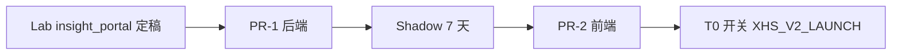

# 现网 PR 清单：`member_portal.html` 合并 AI Tab

> **版本**：v1.0 · **日期**：2026-07-12  
> **目标 URL**：`https://monitor.xhs365.cn/member` **不变**  
> **原则**：扩展现网 `xhs-cloud`，不新开服务/域名  
> **关联**：`20-REQUIREMENTS-V2.2-ROLLOUT.md` §13、`17-XHS-CLOUD-BASE-REUSE.md`

---

## 1. PR 范围摘要

| 项 | 说明 |
|----|------|
| **In Scope** | AI 情报 Tab、profile 权益、insight API、支付 SKU、legacy_gate |
| **Out of Scope** | 新域名、新 VPS、重写支付/登录、PC 客户端大改 |
| **Lab 对照** | `projects/.../insight_portal.html` → UI 迁入现网 |
| **合并策略** | 单 PR 或 **2 个 PR**（后端先行 → 前端跟进） |

---

## 2. 建议 PR 拆分

### PR-1：后端 API + 权益 + Gate（可先 Shadow 上线）

| # | 文件 | 改动 |
|---|------|------|
| 1 | `cloud_deploy/cloud_api/database_pg.py` | 合并 `get_member_entitlements` 扩展；`merge_entitlements` / `portal_route` |
| 2 | `cloud_deploy/cloud_api/` ← `cloud-stubs/legacy_gate.py` | 新增模块 |
| 3 | `cloud_deploy/cloud_api/` ← `cloud-stubs/entitlements_v2.py` | 新增模块 |
| 4 | `cloud_deploy/cloud_api/payment_plans.py` | T0 后 `list_active_plans()` 仅 `insight_*`；保留 Legacy 履约不展示 |
| 5 | `cloud_deploy/cloud_api/payment_service.py` | 回调写 `auth_codes.note` entitlements（`entitlements_note_for_plan`） |
| 6 | `cloud_deploy/cloud_api/main.py` | 挂载 `/api/v1/member/insight/*`；**扩展** `GET /api/v1/member/profile` |
| 7 | `cloud_deploy/cloud_api/main.py` | zip 下载/批量下载首行 `legacy_zip_enabled` → 403 |
| 8 | `cloud_deploy/scripts/` ← `cloud-stubs/insight_routes.py` 逻辑 | 或 inline 进 main |
| 9 | `cloud_deploy/scripts/cloud_insight_report.py` | 从 lab stub 复制；**默认 `--shadow`** |
| 10 | SQL migration | `07-DATABASE-SCHEMA-V2.sql` 节选 + `insight_daily_usage_migration.sql` + `member_insight_watchlist` |
| 11 | `.env.example` | 文档化 `INSIGHT_PG_DSN`（可与 `XHS_DATABASE_URL` 同实例） |

**PR-1 验收**

- [ ] `GET /api/v1/member/profile` 含 `entitlements`、`legacy_zip_enabled`、`insight_enabled`
- [ ] Legacy 在期用户 `legacy_zip_enabled: true`；`insight_*` 用户 `false`
- [ ] 无 Legacy 权益时 `GET .../reports/.../download` → 403
- [ ] `GET /api/v1/payment/plans` T0 后无 `monthly` 等（仅 insight）
- [ ] insight library API 返回 200（可先空列表）
- [ ] 现网登录/续费/收藏 **回归通过**（`run_e2e.sh`）

---

### PR-2：前端 `member_portal.html` 合并 AI Tab

| # | 文件 | 改动 |
|---|------|------|
| 1 | `cloud_deploy/assets/member_portal.html` | **dash-tabs** 增加「AI 选品情报」Tab |
| 2 | 同上 | 新增 `#dashInsight` 面板（类目列表、生成、预览 iframe、额度条） |
| 3 | 同上 | `loadProfile()` 后：若 `!legacy_zip_enabled` 隐藏 Legacy 报告库 Tab 或整段 `#dashReports` |
| 4 | 同上 | 若 `insight_enabled` 默认 `switchDash('insight')` |
| 5 | 同上 | 老用户预览：`insight_preview` 显示横幅 + 链到 AI Tab |
| 6 | 同上 | 购买页文案：数据包 → AI 情报；套餐列表读新 plans |
| 7 | 可选 | 抽离 `member_insight.js`（若 HTML 过大） |
| 8 | `cloud_deploy/assets/member_preview.html` | 无改动或加「返回 AI 情报」链 |

**UI 结构（目标）**

```
dashView
├── expiryBanner
├── dash-tabs
│   ├── [AI 选品情报]   ← 新增，V2 用户默认
│   ├── [报告库 Legacy] ← legacy_zip_enabled 时显示
│   └── [我的收藏]      ← 保留
├── 会员信息 card（不变）
├── #dashInsight        ← 新增
├── #dashReports        ← Legacy，可 hidden
└── #dashWatchlist
```

**PR-2 验收**

- [ ] 新会员（insight_pro）：登录后见 AI Tab，**无** zip 下载入口
- [ ] 老会员在期：Legacy + AI 双 Tab
- [ ] 老会员到期：仅 AI Tab + 续费引导
- [ ] 移动端 375px 布局正常
- [ ] 未登录流程不变

---

## 3. 依赖顺序（合并前）



| 步骤 | 动作 |
|------|------|
| 1 | 实验室 `insight_portal.js` 接口与现网 API 对齐 |
| 2 | 部署 PR-1 到 staging / 生产（前端未改，无用户可见变化） |
| 3 | 跑 `cloud_insight_report.py --shadow` 7 天 |
| 4 | 部署 PR-2 |
| 5 | `XHS_V2_LAUNCH=1` + 公告 |

---

## 4. 现网文件对照（复制来源）

| 现网目标 | 实验室 / stub 来源 |
|----------|-------------------|
| `entitlements_v2.py` | `projects/.../cloud-stubs/entitlements_v2.py` |
| `legacy_gate.py` | `projects/.../cloud-stubs/legacy_gate.py` |
| `payment_plans` 补丁 | `payment_plans_v2_patch.py` |
| insight API | `cloud-stubs/insight_routes.py` + `local-web-prototype/server.py` |
| AI Tab UI | `insight_portal.html` + `insight_portal.js` |
| 情报日更 | `cloud-stubs/cloud_insight_report.py` |

---

## 5. 环境变量（PR-1 文档）

```bash
# 现有
XHS_DATABASE_URL=postgresql://...

# 新增（可与上同实例）
INSIGHT_PG_DSN=postgresql://...   # 只读或同库 xhs_monitor schema
XHS_V2_LAUNCH=0                   # T0 改 1
INSIGHT_K_ANONYMITY=5
INSIGHT_LLM_BUDGET_TOKENS_PER_DAY=200000  # 全局兜底，Per-plan 以 entitlements 为准
```

---

## 6. 回滚方案

| 级别 | 操作 |
|------|------|
| **前端回滚** | 还原 `member_portal.html` 上一版；API 向后兼容 |
| **后端回滚** | 还原 `main.py` insight 路由；保留 profile 新字段无害 |
| **T0 回滚** | `XHS_V2_LAUNCH=0` + 恢复 Legacy plans 展示 |
| **数据** | migration 只 ADD TABLE，不回滚也不影响 Legacy |

---

## 7. 测试计划（合并前必跑）

| 用例 | 步骤 | 期望 |
|------|------|------|
| T1 新会员 | insight_pro 码注册 → `/member` | 默认 AI Tab，无 zip |
| T2 老会员 | monthly 未过期 | Legacy + AI |
| T3 到期 | expires_at 已过 | 下载 403，AI 续费引导 |
| T4 支付 | 扫码 insight_pro | note 含 entitlements |
| T5 收藏 | watchlist CRUD | 与 PR 前一致 |
| T6 情报 | GET library / 打开预生成报告 | 200，无 LLM（读库） |
| T7 回归 | `cloud_deploy/tests/run_e2e.sh` | 全绿 |

---

## 8. PR 描述模板（复制用）

```markdown
## Summary
- 在 `/member` 合并 AI 选品情报 Tab，URL 不变
- 扩展 profile entitlements；Legacy zip 按 expires_at gate
- T0 起新购仅 insight_* SKU

## Test plan
- [ ] run_e2e.sh
- [ ] 新/老/到期 三 persona 手工验
- [ ] 下载 API legacy_gate 403

## Rollback
- 还原 member_portal.html / XHS_V2_LAUNCH=0
```

---

**维护**：PR 合并后更新 `20-REQUIREMENTS-V2.2-ROLLOUT.md` REQ-URL-002/003 为 ✅。
