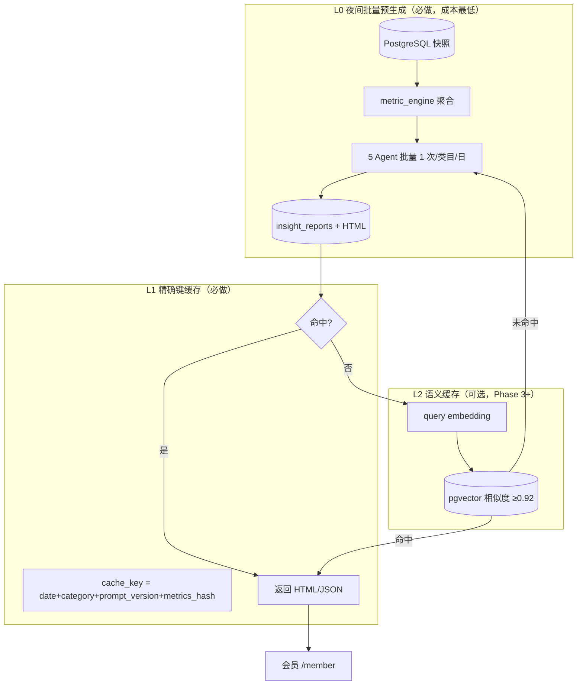

# AI 情报预生成与降本缓存设计（Precompute + Cache）

> **版本**：v1.0 · **日期**：2026-07-12  
> **目标**：最大化降低用户对 LLM 的重复/批量调用；高频类目与常见选品问题 **提前算好入库**，用户访问 **读库不读模型**  
> **技术参考**：[Offline batch inference](https://developers.redhat.com/articles/2025/08/07/batch-inference-openshift-ai-ray-data-vllm-and-codeflare) · [Semantic caching / LangCache](https://redis.io/docs/latest/develop/ai/context-engine/langcache/) · [RAG offline vs online pipeline](https://www.decodingai.com/p/build-rag-pipelines-that-actually)

---

## 1. 概念澄清（不是「训练模型」）

| 用户表述 | 实际含义 | 本方案 |
|----------|----------|--------|
| 提前自动训练 | ❌ 非 fine-tune 大模型 | ✅ **离线批量推理（Batch Inference）** |
| 内置到远程数据库 | ✅ | ✅ PG 存 **指标 + 报告 JSON + HTML 路径** |
| 高频词同一问题 | ✅ | ✅ **精确键缓存 + 可选语义缓存** |
| 降低批量调用 | ✅ | ✅ 用户侧 **Cache-First**，miss 才调 LLM |

**一句话**：把 AI 情报当作 **「日更物料库」** 生产，不是 **「每次提问实时推理」**。

---

## 2. 三层降本架构（推荐，成本递增）



| 层级 | 机制 | 预期 LLM 节省 | 基建成本 |
|------|------|---------------|----------|
| **L0 预生成** | 定时对 TOP-N 类目跑通管道，结果入库 | **80～95%**（日活读固定报告） | ¥0 增量（同 PG + 同机 timer） |
| **L1 精确缓存** | 同 category+date+prompt_version 不重复调 | 在 L0 基础上防重复跑 | ¥0 |
| **L2 语义缓存** | 用户自然语言问句相似则复用 | FAQ/对话场景 30～50% | pgvector 扩展（同 PG） |

**最低成本路径**：**只做 L0 + L1**，已满足「选品情报日报」产品形态。

---

## 3. 预生成内容目录（Playbook）

不是无限问题，而是 **有限「情报场景」** × **类目** × **日期**：

| scenario_id | 说明 | 预生成 | 用户触发 |
|-------------|------|--------|----------|
| `daily_brief` | 类目日度情报（主报告） | ✅ 每日 TOP-N 类目 | 打开即读 |
| `compare_2cat` | 两类目对比 | ✅ 热门组合（如 TOP20 两两或规则组合） | 对比页读库 |
| `timeline_7d` | 7 日趋势叙事 | ✅ 与 metrics 同批 | 时间轴读库 |
| `timeline_30d` | 30 日趋势 | ⚠️ 仅 Pro 类目 | 按需或预生成 |
| `workflow_hint` | 决策卡建议 | 可嵌入 daily_brief | 不单独调 LLM |
| `user_custom_cat` | 用户自选冷门类目 | ❌ 默认不预生成 | **miss → 配额内实时 LLM** |

**N 的取值（成本估算）**

| 档位 | TOP-N 类目/日 | LLM 调用/日（5 Agent） | 说明 |
|------|---------------|------------------------|------|
| 起步 | 20 | ~100 次 | Shadow 阶段 |
| 标准 | 50 | ~250 次 | 覆盖 80% 用户关注 |
| 完整 | 全部有数据类目 | 视 PG 而定 | 成本高，后期再做 |

---

## 4. 数据库设计（扩展 PG，复用现网实例）

在 `07-DATABASE-SCHEMA-V2.sql` 基础上 **追加**：

### 4.1 已有表（直接用作「内置情报库」）

| 表 | 用途 |
|----|------|
| `insight_metrics_daily` | L4 指标快照（**不含**商品 ID 对外） |
| `insight_reports` | AI JSON + `prompt_version` |
| `insight_archives` | 会员列表/预览 HTML 路径 |

### 4.2 新增表（建议）

```sql
-- 预生成任务登记（哪些 scenario 已算完）
CREATE TABLE xhs_monitor.insight_playbook_runs (
    id              BIGSERIAL PRIMARY KEY,
    report_date     DATE NOT NULL,
    scenario_id     VARCHAR(32) NOT NULL,
    category        VARCHAR(128) NOT NULL,
    category_b      VARCHAR(128) DEFAULT '',  -- compare 第二类目
    metrics_hash    VARCHAR(64) NOT NULL,
    prompt_version  VARCHAR(16) NOT NULL,
    report_id       BIGINT REFERENCES xhs_monitor.insight_reports(id),
    status          VARCHAR(16) NOT NULL DEFAULT 'ok',  -- ok|failed|skipped
    llm_tokens      INTEGER DEFAULT 0,
    created_at      TIMESTAMPTZ NOT NULL DEFAULT NOW(),
    UNIQUE (report_date, scenario_id, category, category_b, prompt_version)
);

-- L1 精确缓存索引（可与 insight_reports UNIQUE 合并逻辑）
-- cache_key = sha256(report_date|scenario|category|metrics_hash|prompt_version)

-- L2 语义缓存（Phase 3+，可选）
CREATE TABLE xhs_monitor.insight_query_cache (
    id              BIGSERIAL PRIMARY KEY,
    scenario_id     VARCHAR(32) NOT NULL,
    category        VARCHAR(128) NOT NULL,
    query_text      TEXT NOT NULL,
    query_embedding vector(768),  -- 需 pgvector
    report_id       BIGINT REFERENCES xhs_monitor.insight_reports(id),
    similarity_min  NUMERIC(4,3) DEFAULT 0.920,
    hit_count       INTEGER DEFAULT 0,
    expires_at      TIMESTAMPTZ NOT NULL,
    created_at      TIMESTAMPTZ NOT NULL DEFAULT NOW()
);
CREATE INDEX idx_iqc_embedding ON xhs_monitor.insight_query_cache
    USING ivfflat (query_embedding vector_cosine_ops) WITH (lists = 100);
```

**最低成本**：Phase 2 **只建 `insight_playbook_runs`**，L2 表等真有「自由问答」再做。

---

## 5. 管道设计（Offline Feature Pipeline）

对标 RAG 的 **offline / online 分离**：

| 管道 | 触发 | 输入 | 输出 | LLM |
|------|------|------|------|-----|
| **Offline·指标** | 日报 PG 更新后 | `raw_product_snapshots` | `insight_metrics_daily` | 否 |
| **Offline·情报** | 02:30 timer | metrics + scenario 列表 | `insight_reports` + HTML | **是，批量一次** |
| **Online·阅读** | 用户打开 `/member` | report_date + category | 读库返回 HTML | **否** |
| **Online·自选** | Pro 用户点「生成」 | category + quota | 先查 playbook → miss 才 LLM | 仅 miss |

**定时任务（合并进现网）**

```ini
# 建议在 xhs-daily-report 之后
# xhs-insight-preccompute.timer → OnCalendar=*-*-* 02:30
ExecStart=python cloud_deploy/scripts/cloud_insight_report.py --date today --playbook daily_brief,compare_2cat --top 50
```

与 Legacy `xhs-daily-report.timer`（17:00）**串行**：先 PG 有当日快照，再预生成情报。

---

## 6. Online 请求路径（Cache-First）

```
GET /api/v1/member/insight/report?category=美甲&date=2026-07-12
  1. auth + entitlements + quota（不消耗 LLM 配额若只读）
  2. SELECT insight_playbook_runs / insight_reports WHERE ...
  3. HIT → 返回 html_url + report_json（audit: cache_hit=true）
  4. MISS →
       a. 若用户无「实时生成」权益 → 404「请明日查看或升级」
       b. 若有 quota → run_agents() → INSERT → 返回
  5. record insight_daily_usage（仅 step 4b 计类目配额）
```

**关键**：**打开情报库列表 / 阅读预生成报告 ≠ 调用 LLM**，不计入或计极低配额。

---

## 7. 语义缓存（L2，可选）

适用：**未来**若做「用自然语言问选品问题」对话框。

| 项 | 建议 |
|----|------|
| 嵌入模型 | 低成本：`text-embedding-3-small` 或本地 bge-small（免 API） |
| 存储 | **pgvector** 在现有 PG（无需 Redis LangCache 订阅） |
| 阈值 | 0.90～0.95（越高越省、越怕答非所问） |
| TTL | 与 `report_date` 绑定，日更失效 |
| 隐私 | 入库前 strip 用户 ID；只存 **脱敏问句 + 报告引用** |

行业实践：语义缓存可在高重复场景再降 **30～50%** API 成本（[Gravitee Semantic Cache](https://www.gravitee.io/blog/semantic-caching-for-llms-how-to-reduce-ai-costs-and-latency-at-the-gateway)），但 **L0 预生成**对你们日报形态收益更大。

---

## 8. 需求 ID（写入 PRD）

| ID | 需求 | 优先级 | 阶段 |
|----|------|--------|------|
| REQ-CACHE-001 | 夜间 batch 预生成 TOP-N 类目 `daily_brief` | P0 | Phase 2 |
| REQ-CACHE-002 | 用户阅读预生成报告 **零 LLM** | P0 | Phase 2 |
| REQ-CACHE-003 | `insight_playbook_runs` 登记 scenario 完成态 | P0 | Phase 2 |
| REQ-CACHE-004 | Online Cache-First：`metrics_hash` + `prompt_version` 精确命中 | P0 | Phase 2 |
| REQ-CACHE-005 | 仅「自选类目 miss」走实时 LLM + 扣 quota | P0 | Phase 2 |
| REQ-CACHE-006 | 预生成热门 `compare_2cat` 组合 | P1 | Phase 2 |
| REQ-CACHE-007 | `cloud_insight_report.py` 接入 playbook CLI | P0 | Phase 2 |
| REQ-CACHE-008 | 运营看板：cache_hit_rate / tokens_saved | P2 | Phase 3 |
| REQ-CACHE-009 | pgvector 语义缓存（自由问答） | P3 | 可选 |
| REQ-CACHE-010 | prompt_version 变更时批量失效旧缓存 | P1 | Phase 2 |

---

## 9. 与会员套餐的关系

| 套餐 | 预生成库 | 实时 LLM |
|------|----------|----------|
| Standard | 读 TOP-N + 自己关注类目（若在 playbook） | 3 类目/日 miss 才调 |
| Pro | + compare/timeline 预生成 | 5 类目/日 |
| Team | + 更多类目 slot | 20 类目/日 + 更高 token 预算 |

**Pro 卖点**：不仅是配额，而是 **更多 scenario 预生成 + 更长 timeline**。

---

## 10. 实施顺序（最低成本）

1. **Week 1**：`insight_playbook_runs` 表 + `cloud_insight_report.py --playbook daily_brief --top 20`  
2. **Week 2**：insight API Cache-First；`/member` AI Tab **只读库**  
3. **Week 3**：Pro「自选类目」miss 才 LLM；Token 预算熔断  
4. **Later**：compare 预生成、pgvector 语义缓存  

---

## 11. 成功指标

| 指标 | 目标 |
|------|------|
| cache_hit_rate（阅读请求） | ≥ 85% |
| 日 LLM 调用次数 | ≤ TOP-N × scenarios × 5 Agent |
| 用户侧 P95 打开报告 | < 500ms（读 HTML） |
| Token 成本/活跃会员/日 | 较「全实时」降 ≥ 80% |

---

**关联**：`21-MEMBER-PORTAL-AI-TAB-PR-CHECKLIST.md`、`20-REQUIREMENTS §13`、`07-DATABASE-SCHEMA-V2.sql`、`cloud-stubs/cloud_insight_report.py`
