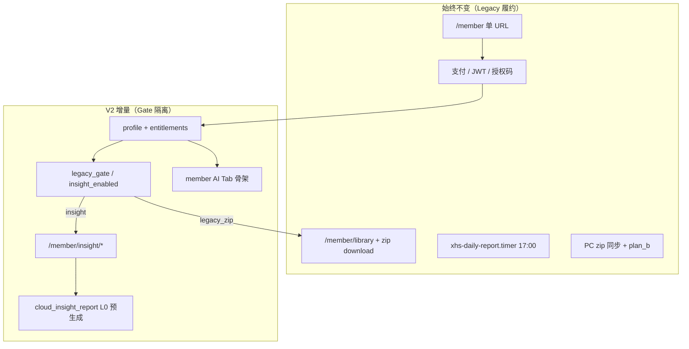

# V2 全局任务路线图（Legacy 隔离版）

> **版本**：v1.0 · **日期**：2026-07-12  
> **铁律**：`https://monitor.xhs365.cn/member` **同址**；**本月已付费 Legacy 会员服务不断**；V2 与 Legacy **并行至各自 `expires_at`**

---

## 1. 隔离架构总览

| 隔离维度 | Legacy 在期用户 | V2 新用户 |
|----------|-----------------|-----------|
| Web 默认 Tab | 报告库（可 + AI 预览） | AI 情报 |
| zip 下载 | ✅ 至 expires_at | ❌ 403 |
| 日报 timer | ✅ 继续 | ✅ 共用 PG 快照（只读） |
| LLM 实时调用 | 不涉及 | ❌ 默认读预生成库 |
| PC zip 同步 | ✅ | ❌ 隐藏 |
| PC 情报 WebView | 预览可选 | ✅ 默认 |

---

## 2. 需求文档地图（您问的两点）

### 2.1 AI 预生成 / 降本 — **已写入**

| 文档 | 状态 | 要点 |
|------|------|------|
| **`22-INSIGHT-PRECOMPUTE-CACHE-DESIGN.md`** | ✅ v1.0 | L0 夜间批量 → PG/HTML；L1 精确缓存；非 fine-tune |
| **`20-REQUIREMENTS-V2.2-ROLLOUT.md`** | REQ-CACHE-001～010 | 与 22 号文档一一对应 |
| 实现 | ⏳ 进行中 | `cloud_insight_report.py --playbook full` 已接 PG；timer 未上 |

**表述澄清**：方案是 **「离线批量推理 + 结果入库」**，不是训练新模型；用户打开情报 **读库不读模型**。

### 2.2 PC 重设计打包 — **本文档体系**

| 文档 | 状态 |
|------|------|
| **`23-PC-CLIENT-V2-REDESIGN-AND-PACKAGING.md`** | ✅ 新增（REQ-PC-*） |
| `09-PC-CLIENT-INTEGRATION.md` | ✅ 接口草案（待 PC-1 实现） |

**同步官网选品报告**：Legacy **保留**；V2 **改为** insight library + WebView，见 23 文档 §3。

---

## 3. 全局任务看板（按轨道）

### 轨道 A — 现网 Legacy（**维护，不重构**）

| ID | 任务 | 负责路径 | 状态 | 备注 |
|----|------|----------|------|------|
| A1 | 日报/周报/月报 timer | `xhs-cloud/systemd/*` | ✅ 现网 | 不动调度 |
| A2 | 会员 library + download | `cloud_api/main.py` | ✅ | + legacy_gate 403 |
| A3 | plan_b report-upload | `main.py` sync | ✅ | Legacy 维护期保留 |
| A4 | 收藏 watchlist | `database_pg.py` | ✅ | V2 并存 |
| A5 | 本月付费用户零感知 | 运营 + Gate | ⚠️ | **禁止**关 Legacy Tab 默认可用 |

### 轨道 B — 云端 V2 API + 会员页（**增量合并**）

| ID | 任务 | 状态 | 备注 |
|----|------|------|------|
| B1 | PR-1 后端 skeleton | ✅ | entitlements / insight routes / gate |
| B2 | PR-2 AI Tab 骨架 | ✅ | **显隐** Gate，Legacy 默认不变 |
| B3 | SQL migration 08 | ⏳ | 需 DBA 执行 |
| B4 | Shadow 7 天 | ⏳ | `insight_shadow` |
| B5 | T0 `XHS_V2_LAUNCH=1` | ⏳ | 仅新购 SKU，老码不受影响 |
| B6 | PR-2 完整 UI（生成/配额） | ⏳ | Phase 3 |

### 轨道 C — 预生成降本（**22 号文档**）

| ID | 任务 | 状态 |
|----|------|------|
| C1 | L0 PG 管道 full | ✅ skeleton |
| C2 | `insight_reports` 表写入 | ⏳ publish 模式 |
| C3 | systemd 02:30 timer | ⏳ |
| C4 | L1 metrics_hash 缓存 | ⏳ |
| C5 | LLM 真调用（可选 Shadow） | ⏳ |
| C6 | Cache-First API（generate 读库） | ⏳ |

### 轨道 D — 实验室（**不绑现网域名**）

| ID | 任务 | 状态 |
|----|------|------|
| D1 | insight_portal + persona | ✅ |
| D2 | 权益门控 + LLM 预算 | ✅ |
| D3 | 报告路径 persona 隔离 | ✅ |
| D4 | `/demo/insight` 公开样例 | ✅ |

### 轨道 E — PC 客户端（**23 号文档**）

| ID | 任务 | 状态 |
|----|------|------|
| E1 | 需求与打包方案 | ✅ doc 23 |
| E2 | cloud_client insight API | ⏳ xhs_shelf_time |
| E3 | 侧栏 Gate + WebView | ⏳ |
| E4 | 安装包 / version.json | ⏳ |
| E5 | Legacy zip UI 隐藏（V2 only） | ⏳ |
| E6 | Electron client 情报入口 | ⏳ P4 |

---

## 4. 时间线建议（与 19 号文档对齐）

| 窗口 | 动作 | Legacy 影响 |
|------|------|-------------|
| **现在～7 月中旬** | 静态 `/demo/insight`、Lab 演示 | 无 |
| **7 月中旬** | 公告 + 老会员 `insight_preview` 码 | 无；可选预览 |
| **8 月 T0** | 新购仅 `insight_*`；AI Tab 默认 | 在期 Legacy **不变** |
| **T0～T+6 月** | 预生成 timer + PC 新包 | Legacy 自然到期 |
| **Legacy 全员到期后** | 隐藏 Legacy Tab；PC 去 zip | 仅到期用户 |

---

## 5. 风险与红线

| 风险 | 缓解 |
|------|------|
| 误关 Legacy 下载 | `legacy_gate` 单元测试 + E2E T3 |
| 会员页改版引起投诉 | Tab **显隐** 非删除；老用户默认报告库 |
| LLM 成本失控 | **强制** Cache-First；generate API Phase 3 才开 |
| PC 强制升级 | version 门控仅安全；Legacy 功能不依赖新包 |
| 实验室误上公网 | Lab 禁止绑 monitor 域名（20 §12.8） |

---

## 6. 下一步 P0（建议执行顺序）

1. **执行** `08_insight_v2_tables.sql`（staging → prod）  
2. **Shadow 7 天**：`cloud_insight_report.py --playbook full` + 验证 library API  
3. **确认** Legacy E2E 全绿（`run_e2e.sh`）  
4. **PC-1**：`xhs_shelf_time` 增 insight API（不改 zip 路径）  
5. **文档**：20 号 REQ-CACHE / REQ-PC 状态同步（本次更新）  
6. **T0 前**：`XHS_V2_LAUNCH` 仅配合新 SKU 上线，**不**批量改老会员 note  

---

## 7. 文档索引速查

| 主题 | 文件 |
|------|------|
| 总需求 | `20-REQUIREMENTS-V2.2-ROLLOUT.md` |
| Legacy 下线策略 | `19-LEGACY-SUNSET-AND-V2-LAUNCH.md` |
| 会员页 PR | `21-MEMBER-PORTAL-AI-TAB-PR-CHECKLIST.md` |
| **预生成降本** | **`22-INSIGHT-PRECOMPUTE-CACHE-DESIGN.md`** |
| **PC 重设计** | **`23-PC-CLIENT-V2-REDESIGN-AND-PACKAGING.md`** |
| **本路线图** | **`24-GLOBAL-TASK-ROADMAP-ISOLATION.md`** |
| PC 接口 | `09-PC-CLIENT-INTEGRATION.md` |
| 现网复用 | `17-XHS-CLOUD-BASE-REUSE.md` |

---

**维护**：每完成 B/C/E 轨道里程碑，更新 §3 状态列与 `20-REQUIREMENTS` 对应 REQ-ID。
