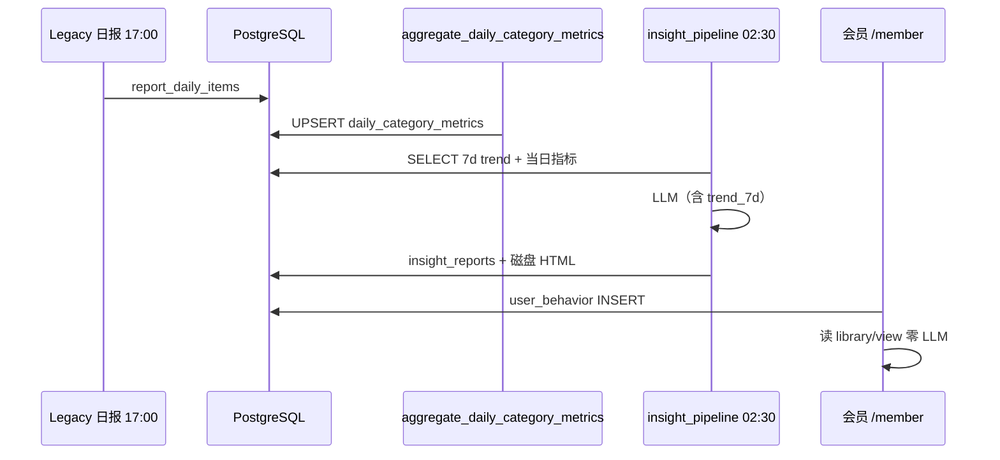

# 27 — 留存粘性 × PG 深度集成需求

> **版本**：v1.0 · **日期**：2026-07-12  
> **来源**：战略评估（留存基准 + PG 管道 + 结构化增强生成）  
> **关联**：`22-INSIGHT-PRECOMPUTE-CACHE-DESIGN.md`、`20-REQUIREMENTS-V2.2-ROLLOUT.md`、`28-MASTER-TODO-TRACKER.md`

---

## 1. 核心判断

产品定位是「AI 选品决策工具」，但 Shadow 阶段数据管道仍偏薄：mock/单日快照 → LLM 仅读 13 个聚合指标 → 报告同质化 → **无每日打开理由、无个性化、无决策闭环**。

| 层次 | 问题 | Shadow 现状 | 目标 |
|------|------|-------------|------|
| **数据层** | 无时序、字段少 | 单日 PG 扫描 | `daily_category_metrics` 预聚合 + 7 日序列 |
| **AI 层** | 无上下文 | 13 静态字段 | 结构化增强（趋势 + 价格带 + 相似类目） |
| **用户层** | 零行为追踪 | 无 | `user_behavior` + 机会雷达 + 试用 SOP |

**模式选择**：选品场景优先 **Structured Data Augmented Generation**（SQL 聚合 → Prompt），非传统文档 RAG。pgvector 相似类目为 P1 增强。

---

## 2. 留存粘性需求（REQ-RET-*）

### F1 — 每日打开理由（P0）

| ID | 需求 | 验收标准 | 阶段 | 状态 |
|----|------|----------|------|------|
| REQ-RET-001 | 每日 08:00「机会雷达」摘要 | 推送/会员页横幅：新增蓝海类目数、增速 Top3 | T1 | ⏳ |
| REQ-RET-002 | 昨日 vs 今日 diff | `daily_category_metrics` 两日对比 API | T1 | ⏳ |
| REQ-RET-003 | L0 预生成 Top-N 类目 | 已有 Shadow timer 02:30 | T0 | ✅ |

### F2 — 个性化（P1）

| ID | 需求 | 验收标准 | 阶段 | 状态 |
|----|------|----------|------|------|
| REQ-RET-010 | `user_behavior` 表 | view/generate/export/feedback/watchlist_add | T1 | ✅ SQL |
| REQ-RET-011 | 浏览/生成埋点 | insight view/library 写 behavior | T1 | ✅ 骨架 |
| REQ-RET-012 | 「为你推荐」区块 | 基于最近 30 天类目频次 | T2 | ⏳ |
| REQ-RET-013 | pgvector 相似类目 | `category_embeddings` + 检索 | T2 | ⏳ |

### F3 — 决策闭环（P2）

| ID | 需求 | 验收标准 | 阶段 | 状态 |
|----|------|----------|------|------|
| REQ-RET-020 | 工作流「已进货/结果」回填 | 会员页或 PC 标记 | T2 | ⏳ |
| REQ-RET-021 | 30 天回填提醒 | 定时任务 + 通知 | T2 | ⏳ |
| REQ-RET-022 | 推荐命中率展示 | 聚合回填 → 信任指标 | T3 | ⏳ |

### F4 — 流失预警（P2）

| ID | 需求 | 验收标准 | 阶段 | 状态 |
|----|------|----------|------|------|
| REQ-RET-030 | 健康度评分模型 | 登录+生成+深度+反馈+额度 | T2 | ⏳ |
| REQ-RET-031 | 评分 &lt; 40 触发运营 | admin 或 webhook | T3 | ⏳ |

### F5 — 体验码转化 SOP（P1）

| ID | 需求 | 验收标准 | 阶段 | 状态 |
|----|------|----------|------|------|
| REQ-RET-040 | Day1 蓝海 Top3 预生成 | 不扣配额 | T1 | ⏳ |
| REQ-RET-041 | Day2 7 日趋势样例 | 展示时间轴价值 | T1 | ⏳ |
| REQ-RET-042 | Day3 Pro 对比 + 限时券 | 支付回调 insight_pro | T1 | ⏳ |

### 留存指标埋点（必须）

| 指标 | 定义 | 目标 |
|------|------|------|
| 次日留存 | 注册后第 2 天登录 | &gt;40% |
| 7 日留存 | 7 天内 ≥3 次 generate/view | &gt;30% |
| 试用转化 | 体验码→付费 | 12–18% |
| 月流失率 | 月付取消 | &lt;5% |
| 决策命中率 | 标记已进货且盈利占比 | &gt;60% |

---

## 3. PG 深度集成需求（REQ-PG-*）

### 3.1 当前问题

- 单表单日 `raw_product_snapshots` / `report_daily_items`，无时序 JOIN
- 6～28 字段混用，类目靠 title 分词
- 每次报告全表扫描，无预聚合
- LLM Prompt 无 7 日趋势

### 3.2 Schema（ADD ONLY）

| 表 | 用途 | 迁移 | 状态 |
|----|------|------|------|
| `daily_category_metrics` | 类目日指标预聚合 | `09_retention_pg_schema.sql` | ✅ |
| `user_behavior` | 用户行为 | 同上 | ✅ |
| `insight_report_cache` | L1 精确缓存（metrics_hash + prompt_version） | 同上 | ✅ |
| `category_embeddings` | pgvector 相似类目 | `10_pgvector_embeddings.sql`（T2） | ⏳ |

### 3.3 数据流

### 3.4 AI Prompt 增强（REQ-PG-010～012）

| ID | 需求 | 验收标准 | 状态 |
|----|------|----------|------|
| REQ-PG-010 | Prompt 增加 `trend_7d` | `_metrics_prompt` 含 7 日序列 | ✅ |
| REQ-PG-011 | Prompt 增加 `price_distribution` | 价格带分布 JSON | ⏳ |
| REQ-PG-012 | Prompt 增加 `user_context` | 个性化上下文（P2） | ⏳ |

### 3.5 批处理任务

| ID | 脚本 | 调度 | 状态 |
|----|------|------|------|
| REQ-PG-020 | `aggregate_daily_category_metrics.py` | 02:00（在 L0 前） | ✅ |
| REQ-PG-021 | pipeline 写回 metrics + 读 trend | 02:30 Shadow | ✅ |
| REQ-PG-022 | `insight_report_cache` 读写 | T1 Cache-First | ⏳ |

---

## 4. 优先级（与 doc 28 对齐）

| 优先级 | 编号 | 任务 | 依赖 |
|:---:|:---:|------|------|
| **P0** | PG-1 | `daily_category_metrics` + 聚合脚本 | PG 已有 |
| **P0** | AI-1 | LLM Prompt +7 日趋势 | PG-1 |
| **P0** | T0 | Shadow 7 天 + W1-5 smoke | 现网 |
| P1 | F1 | 机会雷达推送 | PG-1 |
| P1 | F2 | user_behavior + 推荐 | PG-1 |
| P1 | F5 | 体验码 3 天 SOP | F1 |
| P2 | PG-2 | pgvector 相似类目 | PG-1 |
| P2 | F3/F4 | 闭环 + 健康度 | F2 |

---

## 5. 一句话结论

合规与 Agent 编排已就绪；**最大杠杆**是 PG 预聚合让 LLM 看见变化、每日机会雷达给打开理由、`user_behavior` 驱动个性化。T0 不阻塞 Legacy；T1 起并行 REQ-RET-* 与 REQ-PG-*。

**执行清单**：见 **`28-MASTER-TODO-TRACKER.md`**。
