# 29 — V2 全链路一键部署 Runbook

> **用途**：开发 push 后，运维/Agent **一条命令**完成 pull → 迁移 → 重启 → 验收。  
> **脚本**：`xhs-cloud/cloud_deploy/scripts/v2-oneclick-deploy.sh`  
> **待办总表**：`28-MASTER-TODO-TRACKER.md`  
> **开发机 push+SSH**：`scripts/v2-push-and-deploy.ps1`

---

## 0. 双端操作速查

| 端 | 谁做 | 命令 |
|----|------|------|
| **开发机** | Agent / 开发 | `git push` 或 `scripts\v2-push-and-deploy.ps1` |
| **云主机** | 运维 / SSH | `bash .../v2-oneclick-deploy.sh` |
| **浏览器** | 人工 30s | Ctrl+Shift+R → AI Tab 目测 |

### 0.1 开发机全链路（Windows + SSH）

```powershell
cd E:\vuemonitor
$env:XHS_DEPLOY_SSH = 'root@你的ECS'
$env:XHS_MEMBER_TOKEN = 'eyJ...'    # F12 → Application → localStorage → xhs_member_token
$env:XHS_SMOKE_EXPECT = 'legacy_dual'
powershell -ExecutionPolicy Bypass -File scripts\v2-push-and-deploy.ps1 -Message "feat: xxx"
```

无 SSH 时脚本只 push，并打印云主机命令块。

---

## 1. 全链路阶段图

```mermaid
flowchart LR
  A[git push main] --> B[v2-oneclick-deploy.sh]
  B --> C[rsync /opt/xhs-cloud]
  C --> D[PG 08+09 迁移]
  D --> E[host-update API]
  E --> F[health + JS 200]
  F --> G[smoke 8项]
  G --> H[浏览器 Ctrl+Shift+R]
  H --> I[Shadow D1-D7]
  I --> J[T1 XHS_V2_LAUNCH]
  J --> K[GA Legacy sunset]
```



---

## 2. 云主机 — 只跑这一条（选品会员 xhs-cloud）

> **不要**和下面的 `scripts/host-update.sh` 混用——那是 SaaS 主站（admin API），你已经跑过了。

```bash
# Token：浏览器 F12 → Application → localStorage → xhs_member_token（不要用字面量 ...）
export XHS_MEMBER_TOKEN='粘贴真实eyJ...'
export XHS_SMOKE_EXPECT=legacy_dual

bash /opt/vuemonitor/xhs-cloud/cloud_deploy/scripts/v2-oneclick-deploy.sh
```

脚本路径在 **git 仓库里**，不依赖 `/opt/xhs-cloud` 是否已有该文件。  
无 Token 时：`SKIP_SMOKE=1 bash /opt/vuemonitor/xhs-cloud/cloud_deploy/scripts/v2-oneclick-deploy.sh`

**nginx 限流**：脚本内自动执行 `ensure_nginx_insight_limits.sh`，**无需手改 nginx.conf**。

---

## 2.1 两个子系统对照

| 你要更新什么 | 命令 |
|-------------|------|
| **会员页 + 选品 API**（monitor.xhs365.cn） | `bash /opt/vuemonitor/xhs-cloud/cloud_deploy/scripts/v2-oneclick-deploy.sh` |
| **Admin 后台 + SaaS API**（admin.xhs365.cn） | `cd /opt/vuemonitor && git pull && bash scripts/host-update.sh` |

---

## 2.2 旧版分步（可忽略，已由一键脚本包含）

```bash
SKIP_SMOKE=1 bash /opt/xhs-cloud/cloud_deploy/scripts/v2-oneclick-deploy.sh
```

### 2.3 部署并立即试跑 Shadow

```bash
RUN_SHADOW_NOW=1 bash /opt/xhs-cloud/cloud_deploy/scripts/v2-oneclick-deploy.sh
```

### 2.4 账号密码冒烟（无浏览器 Token）

```bash
export XHS_SMOKE_USER='用户名'
export XHS_SMOKE_PASS='密码'
export XHS_SMOKE_EXPECT=legacy_dual
bash /opt/xhs-cloud/cloud_deploy/scripts/v2-oneclick-deploy.sh
```

---

## 3. 脚本步骤对照

| 步骤 | 动作 | 失败处理 |
|:---:|------|----------|
| 1 | `git fetch` + `reset --hard origin/main` | 检查 `/opt/vuemonitor` 网络 |
| 2 | `rsync` vuemonitor/xhs-cloud → `/opt/xhs-cloud` | 保留 data/venv/.env |
| 3 | `psql` 08 + 09 迁移 | `SKIP_MIGRATE=1` 跳过 |
| 4 | `host-update.sh` | `systemctl status xhs-cloud-api` |
| 5 | health + member_insight.js 200 | 查端口 8080 |
| 5b | 可选 `aggregate_daily_category_metrics` | `SKIP_AGGREGATE=1` |
| 6 | `insight_shadow_smoke.sh` | 设 Token 或 SKIP_SMOKE=1 |

**成功标志：**

```
✓ health HTTP 200
✓ member_insight.js HTTP 200
✓ smoke PASS
Result: 8 passed, 0 failed
```

---

## 4. 浏览器验收（人工 30 秒）

1. https://monitor.xhs365.cn/member
2. **Ctrl+Shift+R**（建议无痕窗口，避免 layui 插件干扰）
3. 老月卡应见 **报告库 + AI 选品情报** 双 Tab
4. AI Tab：套餐条 + **今日机会雷达** + 4 条类目 + iframe 预览

Console 可忽略 `layer.js` / `layui`（浏览器扩展注入）。

---

## 5. 全链路 TODO 总表（与 doc 28 同步）

> **勾选规则**：每完成一批开发 → push → 跑一键脚本 → 在 doc 28 把对应 `[ ]` 改 `[x]`。

### ✅ 已完成（2026-07-12）

- [x] T0 双轨 `legacy_dual` + smoke **8/8**
- [x] Shadow timer + LLM admin
- [x] T1 radar / generate / watchlist API
- [x] 会员页 AI Tab + 机会雷达 UI（浏览器 E2E 已验收）
- [x] 一键脚本 `v2-oneclick-deploy.sh` + 本 Runbook + `v2-push-and-deploy.ps1`

### 🔄 进行中（T0 出口）

- [ ] Shadow **D1–D7** `journalctl -u xhs-insight-report.service` 无 ERROR
- [ ] LLM mode=on 至少 1 天 4+ 类目 HTML
- [ ] 7 天 timer 成功率 100%

### ⏳ T1 下一批（开发后同样一键部署）

- [ ] `XHS_V2_LAUNCH=1` 仅 insight SKU
- [ ] admin 发 insight 体验码
- [ ] nginx insight 限流
- [ ] `aggregate` systemd 02:00 timer
- [ ] `insight_report_cache` L1

### ⏳ T2 / GA

- [ ] pgvector 相似类目
- [ ] 个性化推荐 + 健康度
- [ ] PC 合并 + Legacy sunset

---

## 6. 日常运维指令速查

| 场景 | 命令 |
|------|------|
| **每次 push 后** | `bash .../v2-oneclick-deploy.sh` |
| 只看 Shadow 日志 | `journalctl -u xhs-insight-report.service -n 50 --no-pager` |
| 手动 Shadow | `bash .../run_insight_report_shadow.sh $(date +%F)` |
| 仅冒烟 | `bash .../insight_shadow_smoke.sh` |
| PG 预聚合 | `PYTHONPATH=/opt/xhs-cloud venv/bin/python .../aggregate_daily_category_metrics.py $(date +%F)` |

---

## 7. 与 vuemonitor 主站关系

| 子系统 | 路径 | 一键脚本 |
|--------|------|----------|
| **选品会员 xhs-cloud** | `/opt/xhs-cloud` | **本脚本** |
| SaaS server + admin | `/opt/vuemonitor` | `bash /opt/vuemonitor/scripts/host-update.sh` |

改 `web-admin` 情报 LLM 页时需 **两条都更新**；仅改会员页/xhs-cloud API 时 **只跑本脚本**。

---

## 8. 更新日志

| 日期 | 变更 |
|------|------|
| 2026-07-12 | 初版：全链路一键脚本 + 本 Runbook |
